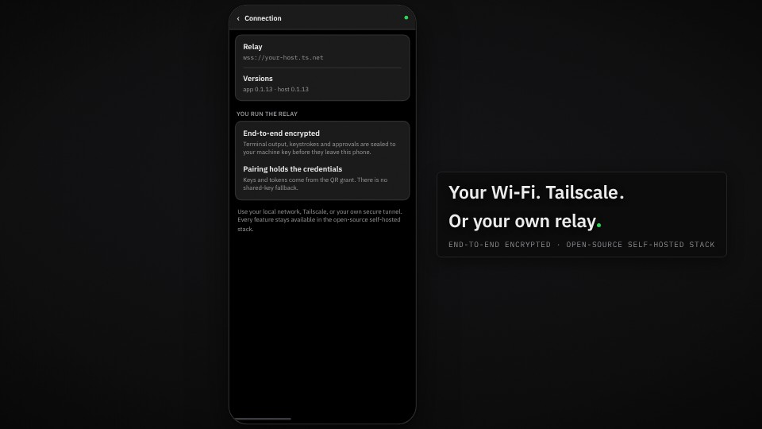

<h1 align="center">
  <a href="https://trymuxr.com"></a> muxr
</h1>

<p align="center">
  <a href="https://www.npmjs.com/package/@trymuxr/cli"></a>
  <a href="https://github.com/umeranjum17/muxr/actions/workflows/ci.yml"></a>
  <a href="LICENSE"></a>
  
</p>

<p align="center">
  <strong>Every agent. The real terminal. In your pocket.</strong><br/>
  muxr is a mobile-first client for the coding agents running on your computers. See the whole herd at a glance — who's working, who needs you, who's done. Open any agent's exact live terminal, prompt it like you're at the desk, and watch it keep executing on your machine. Not a dashboard about your agents — the same session, built for a thumb.
</p>

<h3 align="center"><a href="https://trymuxr.com/docs/quickstart"><ins>Get muxr</ins></a></h3>

<p align="center">
  <a href="https://play.google.com/apps/testing/com.trymuxr.app">Google Play testing</a> ·
  <a href="https://github.com/umeranjum17/muxr/issues/new?template=mobile-access.yml">Request TestFlight</a> ·
  <a href="https://github.com/umeranjum17/muxr/releases/download/v0.1.7/muxr-0.1.7.apk">Latest direct APK: 0.1.7</a> ·
  <a href="https://github.com/umeranjum17/muxr/releases">All releases</a>
</p>

<p align="center">
  <a href="https://trymuxr.com/#demo"></a>
</p>

## Why muxr exists

Coding agents made programming asynchronous: they work for minutes or hours, then stop and wait for you. Your phone is where you already are during those waits — but a terminal squeezed into a phone browser is unusable, and a notification app cannot actually answer.

muxr is the control surface built natively for the phone: the full agent lifecycle on one screen, the exact terminal when you tap in, and a prompt box that talks to the same session. Execution, code, credentials, and model subscriptions stay on your computers.

## See it in action

<table>
<tr>
<td width="45%" valign="middle">

### The whole herd, then the exact terminal

Every agent on every machine, grouped by repo, with live status: working, needs you, done. Tap the one that needs you and you are in its real terminal — same scrollback, same session — not a summary of it. Type or dictate the next prompt and the agent continues on your computer.

[Watch the full demo →](https://trymuxr.com/#demo)

</td>
<td width="55%">
  <a href="https://trymuxr.com/#demo"><picture><source srcset="docs/assets/readme/herd.webp" type="image/webp"></picture></a>
</td>
</tr>
<tr>
<td width="45%" valign="middle">

### Review before it ships

Open the real diff, inspect every changed line, then accept or reject it without waiting to get back to your desk.

</td>
<td width="55%">
  <picture><source srcset="docs/assets/readme/changes.webp" type="image/webp"></picture>
</td>
</tr>
<tr>
<td width="45%" valign="middle">

### Talk to the work

Use native realtime speech-to-speech when typing is the slow part. Ask what changed, give a follow-up, and keep the same agent context.

[Voice setup →](docs/VOICE-SETUP.md)

</td>
<td width="55%">
  <picture><source srcset="docs/assets/readme/voice.webp" type="image/webp"></picture>
</td>
</tr>
<tr>
<td width="45%" valign="middle">

### Your relay or ours. Never our eyes.

Connect over Wi-Fi, Tailscale, a relay you run, or muxr Cloud's optional managed relay. Either way, terminal output, keystrokes, and approvals are end-to-end encrypted before they leave your devices. The relay routes ciphertext it cannot read.

[Self-hosting →](docs/SELF-HOSTING.md) · [Privacy →](https://trymuxr.com/docs/privacy) · [Architecture →](docs/ARCHITECTURE.md) · [Security →](SECURITY.md)

</td>
<td width="55%">
  <picture><source srcset="docs/assets/readme/self-host.webp" type="image/webp"></picture>
</td>
</tr>
</table>

**Also on your phone:**

- **Live terminals and notifications** — see every running session and know the moment one needs you.
- **Files, attachments, ports, usage, and runbooks** — inspect the machine without squeezing a desktop UI onto a phone.
- **[Extensions](https://trymuxr.com/docs/plugins)** — add phone-native controls and screens without forking the app.

The [release history](https://github.com/umeranjum17/muxr/releases) is the real feature list.

## The whole party, in one place

Parallel agents work like a party: each has a job, a state, and moments when it needs you. muxr keeps the real terminals, diffs, inbox, voice, and relay controls together without hiding what is happening.


## Cloud without a cloud computer

Your phone and computer need a way to find each other across networks. They do not need us to run your agents.

**muxr Cloud** is the optional managed relay. Your computer connects outbound; your phone connects to the same relay. It moves end-to-end-encrypted frames and wakes the phone when an agent needs attention. It cannot read terminal text, prompts, responses, keystrokes, files, or pairing secrets. Agents, repositories, credentials, and encryption keys stay on your computer.

muxr Cloud is rolling out to testers now. Self-hosting is available to everyone today over Wi-Fi, Tailscale, or a VPS. The app and features are the same either way.

[Privacy and trust →](https://trymuxr.com/docs/privacy) · [Self-hosting →](docs/SELF-HOSTING.md)

## Install

You need [Node.js 22 or newer](https://nodejs.org/) on Linux, macOS, or WSL. muxr installs [Herdr](https://herdr.dev) during setup if it is missing.

```bash
npm install -g --ignore-scripts @trymuxr/cli
muxr
```

Then install the mobile companion:

- **Android:** [join Google Play testing](https://play.google.com/apps/testing/com.trymuxr.app) · [download the latest direct APK (0.1.7)](https://github.com/umeranjum17/muxr/releases/download/v0.1.7/muxr-0.1.7.apk) · [SHA256SUMS](https://github.com/umeranjum17/muxr/releases/download/v0.1.7/SHA256SUMS)
- **iOS:** [request TestFlight access](https://github.com/umeranjum17/muxr/issues/new?template=mobile-access.yml)
- **Web:** pair an eight-hour read-only browser during self-hosted setup
- **All builds:** [GitHub Releases](https://github.com/umeranjum17/muxr/releases)

Verify a downloaded APK with `sha256sum --ignore-missing -c SHA256SUMS`, then run `muxr`, choose **Apply setup**, and scan the one-use QR from the phone. Start with LAN when both devices are on the same Wi-Fi.

[Read the step-by-step quickstart →](https://trymuxr.com/docs/quickstart)

## Use the agents you already have

muxr connects to sessions [Herdr](https://github.com/herdrdev/herdr) already runs. Your CLIs, subscriptions, configuration, skills, and MCP servers stay as they are.

<p>
  
  
  
  
  
  
  
  
  
  
  
  
  
  
  
  
  
  
  
  
  
</p>

## Extensions

Add phone-native controls, screens, files, diffs, metrics, shortcuts, and realtime streams through the public extension API.

[Extension guide →](https://trymuxr.com/docs/plugins) · [Bundled examples →](plugins/)

## Development

```bash
git clone https://github.com/umeranjum17/muxr
cd muxr
yarn install --frozen-lockfile
yarn typecheck
node scripts/runSuite.mjs
```

See [CONTRIBUTING.md](CONTRIBUTING.md) for development setup and pull requests.

## License

muxr is licensed under [Apache License 2.0](LICENSE). Third-party notices are recorded in [NOTICE](NOTICE) and the [license inventory](docs/license-inventory.md). The muxr name and marks are covered by [TRADEMARK.md](TRADEMARK.md).
