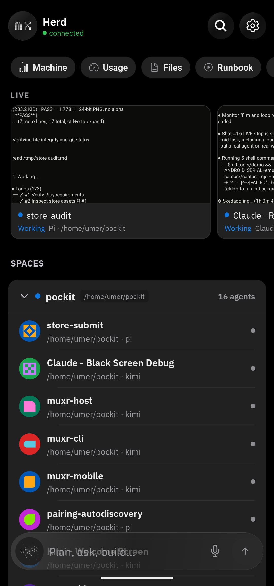
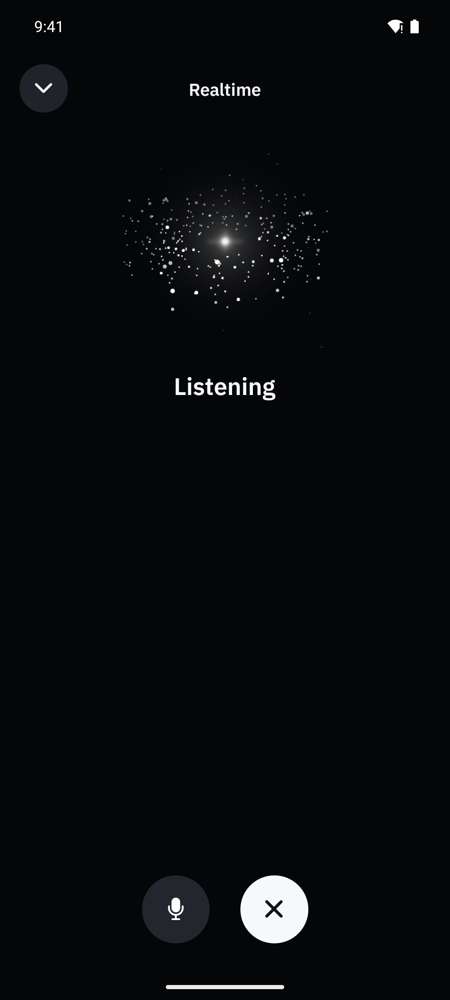
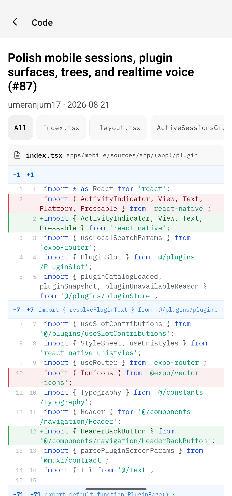
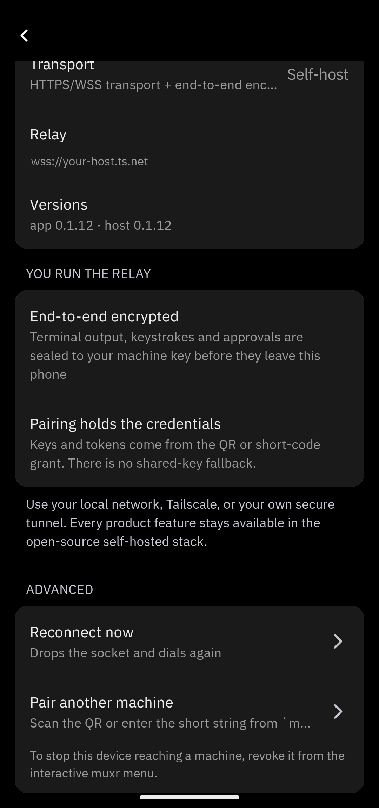

<p align="center">
  
</p>

<h1 align="center">muxr</h1>

<p align="center"><strong>Every coding agent, on your phone.</strong></p>

<p align="center">
  muxr shows you which agents need attention and lets you answer from your phone. The work stays on your computer; you do not have to.
</p>

<p align="center">
  <a href="https://trymuxr.com">Website</a> ·
  <a href="https://trymuxr.com/docs/quickstart">Quickstart</a> ·
  <a href="https://trymuxr.com/#demo">Demo</a> ·
  <a href="https://github.com/umeranjum17/muxr/releases/latest">Android</a> ·
  <a href="https://trymuxr.com/docs/plugins">Extensions</a>
</p>

<p align="center">
  <a href="https://www.npmjs.com/package/@trymuxr/cli"></a>
  <a href="https://github.com/umeranjum17/muxr/actions/workflows/ci.yml"></a>
  <a href="LICENSE"></a>
</p>

[](https://trymuxr.com/#demo)

<p align="center">
  
  
  
  
</p>


## Why muxr

- **Know when you are needed.** See every agent in one place and spot the ones waiting for input.
- **Unblock the work from anywhere.** Answer prompts, use the terminal, review changes, move files, or talk to an agent from your phone.
- **Keep one continuous session.** Step away and come back to the same agents, terminals, and context.
- **Keep control of your work.** Your agents run on your computers. Connections are end-to-end encrypted, and the host and relay are open source.

## Install

You need [Node.js 22 or newer](https://nodejs.org/) on Linux, macOS, or WSL. muxr installs [Herdr](https://herdr.dev) automatically during setup if it is missing.

```bash
npm install -g --ignore-scripts @trymuxr/cli
muxr
```

Then:

1. Install muxr on your phone from TestFlight, Google Play internal testing, or the signed Android APK below.
2. Run `muxr`. It checks the computer, installs Herdr if needed, and asks how your phone should connect. Start with LAN if both devices are on the same wifi.
3. Choose **Apply setup**, open the phone app, and scan the one-use QR.

- **Android:** internal testing on Google Play · [signed APK and SHA256SUMS](https://github.com/umeranjum17/muxr/releases/latest)
- **iOS:** internal testing on TestFlight
- **Web:** choose the eight-hour read-only browser client during setup

[Request mobile access](https://github.com/umeranjum17/muxr/issues), or read the [step-by-step quickstart](https://trymuxr.com/docs/quickstart).

## Use the agents you already have

muxr connects to the sessions [Herdr](https://github.com/herdrdev/herdr) already runs. Your CLIs, subscriptions, configuration, skills, and MCP servers stay as they are.

<p>
  
  
  
  
  
  
  
  
  
  
  
  
  
  
  
  
  
  
  
  
  
</p>

## Extensions

Add phone-native controls, screens, files, diffs, metrics, shortcuts, and realtime streams through the public extension API.

Start with the [extension guide](https://trymuxr.com/docs/plugins) and the [bundled examples](plugins/).

## Self-hosting

Run muxr on one computer or connect several through a relay you operate. Use your local network, Tailscale, Cloudflare, or your own WSS endpoint.

- [Quickstart](https://trymuxr.com/docs/quickstart)
- [Self-hosting](docs/SELF-HOSTING.md)
- [Architecture](docs/ARCHITECTURE.md)
- [Security](SECURITY.md)
- [Voice](docs/VOICE-SETUP.md)

## Development

```bash
git clone https://github.com/umeranjum17/muxr
cd muxr
yarn install --frozen-lockfile
yarn typecheck
node scripts/runSuite.mjs
```

See [CONTRIBUTING.md](CONTRIBUTING.md) for development setup and pull requests.

## License

muxr is licensed under [Apache License 2.0](LICENSE). Third-party notices are recorded in [NOTICE](NOTICE) and the [license inventory](docs/license-inventory.md). The muxr name and marks are covered by [TRADEMARK.md](TRADEMARK.md).
