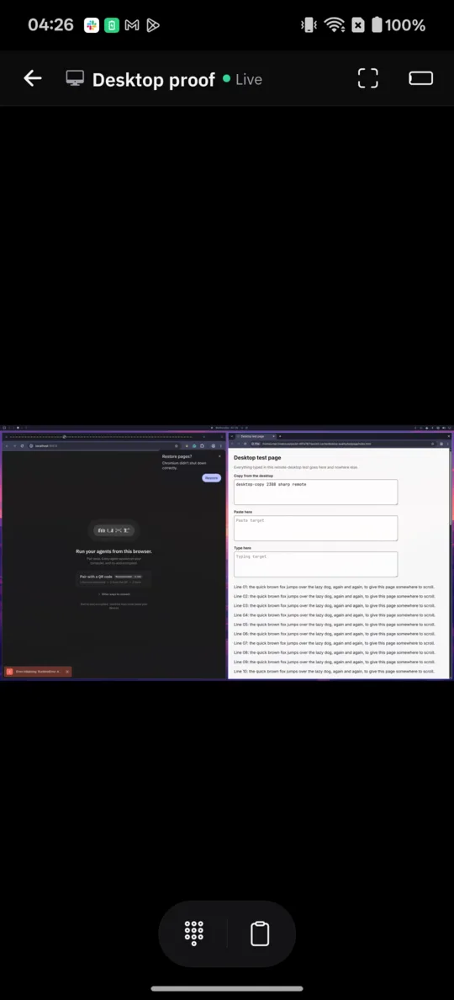
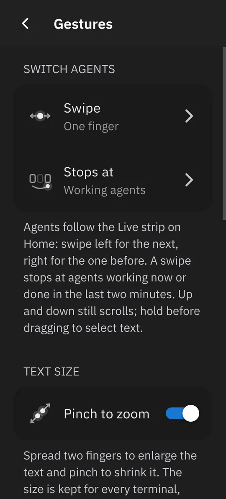

<div align="center">

<pre>
███╗   ███╗██╗   ██╗██╗  ██╗██████╗
████╗ ████║██║   ██║╚██╗██╔╝██╔══██╗
██╔████╔██║██║   ██║ ╚███╔╝ ██████╔╝
██║╚██╔╝██║██║   ██║ ██╔██╗ ██╔══██╗
██║ ╚═╝ ██║╚██████╔╝██╔╝ ██╗██║  ██║
╚═╝     ╚═╝ ╚═════╝ ╚═╝  ╚═╝╚═╝  ╚═╝
</pre>

**Your coding agents, their real terminals, and your computer's screen — on your phone.**

<a href="https://www.npmjs.com/package/@trymuxr/cli"></a>
<a href="https://github.com/umeranjum17/muxr/actions/workflows/ci.yml"></a>
<a href="LICENSE"></a>


[**Get muxr**](https://trymuxr.com/docs/quickstart) · [Android APK](https://trymuxr.com/downloads/stable/android) · [Google Play testing](https://play.google.com/apps/testing/com.trymuxr.app) · [iOS TestFlight](https://testflight.apple.com/join/aJSbs8pN) · [All downloads](https://trymuxr.com/downloads)

<!-- Hero: every phone screen here is a real capture of the app. Add the launch loop once it is rendered from real app footage. -->

&nbsp;&nbsp;


</div>

## What it is

Coding agents work for minutes or hours, then stop and wait for you. muxr puts every one of them on your phone: see who is working, who needs you and who is done, open the agent's exact live terminal, and answer it with your thumb. When you want the whole picture, peek at your computer's screen and watch what the agent is doing right now.

It is self-hosted and open source. The agents, code, keys and model subscriptions stay on your computer, and muxr runs no server your sessions pass through.

## What you can do

- **Peek at your computer.** Tap **Computer** inside an agent's conversation and your own desktop appears live — see what the agent is up to, then take over with a pointer that follows your finger, a keyboard and a shared clipboard.
- **Every agent at a glance.** Home and the Herd show each agent's live terminal and state across repositories and machines. Inbox collects the ones that need you.
- **The real terminal.** The same session the agent runs at your desk, with scrollback, modifier keys and a prompt box. When an agent asks a numbered question, tap the answer.
- **Swipe between agents.** One finger sideways moves to the next working or waiting agent. **Settings → Gestures** switches to a two-finger swipe, turns swiping off, and turns pinch-to-zoom on or off.
- **Know your limits.** The **Right now** card on Home shows every connected plan's limits at a glance; **Usage** shows each window's percent left, reset time and pace.
- **Start and review work.** Start a new agent in any repository or worktree, read its diff, and accept or reject the changes.
- **Talk to the herd.** Native realtime voice when typing is the slow part. [Voice setup →](docs/VOICE-SETUP.md)
- **Phone or browser.** The Android and iOS apps, or pair a browser for full control or view-only access.

## Remote desktop

Open **Computer** from an agent's conversation to see your computer's screen live. Look first; nothing is sent until you tap. Drag and the pointer follows your finger, tap to click, and open the keyboard or clipboard from the floating buttons (in a browser, allow clipboard access when it asks). After you lock the phone or lose the connection, the picture comes back with control off until you tap **Tap to control**.

Pair once, and the desktop works over the same route as your agents:

| Your phone reaches the computer over | Agents and terminal | Desktop |
|---|---|---|
| Tailscale | Android, iOS, browser | Android, browser — direct, peer to peer |
| Any mesh VPN or a LAN address | Android, iOS, browser | Android, browser — direct, peer to peer |
| SSH only, such as a cloud server with just port 22 open | Android app | Android app — carried inside the same SSH connection |

A cloud server with no screen needs the virtual-display packages installed once; muxr then starts a private screen for it. See [remote desktop on a cloud server](docs/SELF-HOSTING.md#remote-desktop-on-a-cloud-server).

## How it fits together

```text
  phone or browser              relay                         your computer
 ┌───────────────┐   E2EE   ┌──────────────┐    E2EE    ┌───────────────────────────┐
 │ muxr app      │◄────────►│ routes       │◄──────────►│ muxr host                 │
 │  agents       │          │ ciphertext   │            │  ├─ Herdr ─► your agents  │
 │  terminals    │          │ it can't read│            │  └─ desktop engine        │
 │  Computer     │          └──────────────┘            │       screen, pointer,    │
 └───────┬───────┘                                      │       keys, clipboard     │
         │   peek / control: encrypted WebRTC,          └─────────────▲─────────────┘
         └── direct, or inside your SSH connection ───────────────────┘
```

The relay runs on your computer or on a server you own. It forwards sealed envelopes and never sees terminal text, prompts, keystrokes or files. The desktop picture does not go through the relay at all.

## Install and pair once

On the computer that runs your agents (Linux, macOS or WSL, with [Node.js 22 or newer](https://nodejs.org/)):

```bash
npm install -g --ignore-scripts @trymuxr/cli@latest
muxr
```

Setup looks at the machine without changing anything, shows the six ways your phone can reach it, and recommends one. Nothing changes until **Apply setup**. muxr installs [Herdr](https://herdr.dev), which runs the agents, if it is missing.

Then scan the one-use QR code with the app. The phone stays paired until you revoke it with `muxr devices revoke`. To pair a browser instead, run `muxr pair --browser` (full control) or `muxr pair --browser-view` (view only).

Get the app:

- **Android:** [stable APK](https://trymuxr.com/downloads/stable/android) ([checksum](https://trymuxr.com/downloads/stable/checksums)) or [Google Play testing](https://play.google.com/apps/testing/com.trymuxr.app)
- **iOS:** [TestFlight](https://testflight.apple.com/join/aJSbs8pN)
- **Newest builds:** `npm install -g --ignore-scripts @trymuxr/cli@nightly` and the [nightly APK](https://trymuxr.com/downloads/nightly), which installs alongside the stable app

To verify an APK, save the channel's checksum next to it as `SHA256SUMS` and run `sha256sum --ignore-missing -c SHA256SUMS`.

[Step-by-step quickstart →](https://trymuxr.com/docs/quickstart) · [Self-hosting →](docs/SELF-HOSTING.md)

## Honest limits

- **Remote desktop host:** Linux x64 today (glibc 2.36 or newer). macOS comes later. An Arm server needs the desktop engine [built from source](packages/desktop-host/README.md#building-from-source).
- **Remote desktop release:** the desktop engine ships with the next CLI release; earlier releases have agents and terminals only.
- **Cloud servers:** install the virtual-display packages once ([one command](docs/SELF-HOSTING.md#remote-desktop-on-a-cloud-server)).
- **Desktop control on a normal Linux desktop:** viewing works out of the box; control needs a one-time [input permission](packages/desktop-host/README.md#kernel-input-access) you grant yourself.
- **Desktop clients:** the Android app and the browser. The iOS app has agents and terminals but no desktop yet.
- **SSH route:** the Android app only, with RSA or ECDSA keys.
- **No video relay:** the desktop needs a direct path (mesh, LAN) or SSH. If the phone and computer can only meet through a relay, the terminal works but the picture will not connect.

## Private by design

- Self-hosted: your relay, your computer, your pairing. muxr operates no backend your sessions pass through.
- End-to-end encrypted: terminal text, prompts, keystrokes, files and pairing secrets are sealed on your devices.
- Nothing leaves the computer: agents, repositories, credentials, model subscriptions and encryption keys stay where they are.

[Privacy and trust →](https://trymuxr.com/docs/privacy) · [Security policy →](SECURITY.md)

## Use the agents you already have

muxr connects to the agents [Herdr](https://github.com/herdrdev/herdr) runs: 20+ agent CLIs and plain shells. Your CLIs, subscriptions, configuration, skills and tools stay as they are, and muxr never edits agent instruction files. Agents can load muxr's own guide with `muxr --skill` when they need it.

<p align="center">
  
  
</p>

## Extensions

Add phone-native controls, screens, files, diffs, metrics, shortcuts and realtime streams without forking the app. [Extension guide →](https://trymuxr.com/docs/plugins)

## Development

```bash
git clone https://github.com/umeranjum17/muxr
cd muxr
yarn install --frozen-lockfile
yarn typecheck
yarn run check
```

See [CONTRIBUTING.md](CONTRIBUTING.md). Merging into `main` advances development, not production; releases follow the [release channel workflow](docs/RELEASING.md). The [release history](https://github.com/umeranjum17/muxr/releases) is the full feature list.

## License

[Apache License 2.0](LICENSE). Third-party notices are in [NOTICE](NOTICE) and the [license inventory](docs/license-inventory.md). The muxr name and marks are covered by [TRADEMARK.md](TRADEMARK.md).
