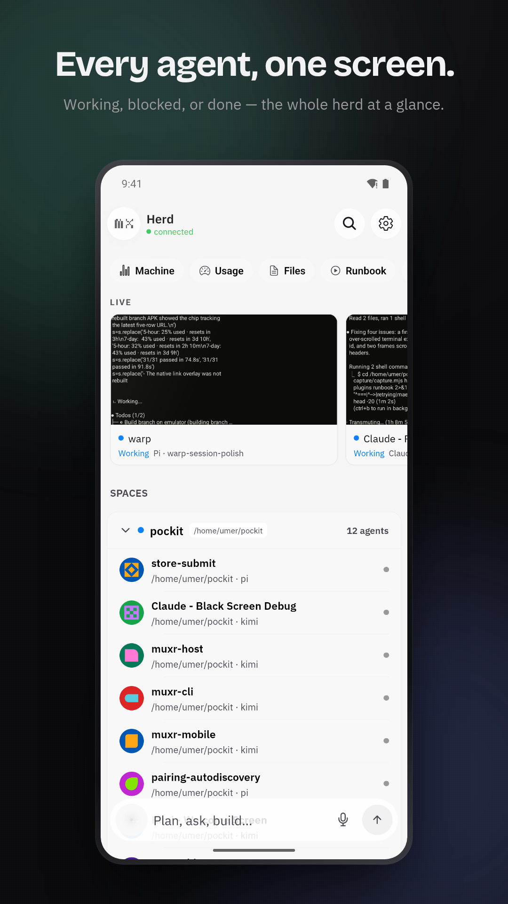

<p align="center">
  
</p>

<h1 align="center">muxr</h1>

<p align="center"><strong>Every coding agent, on your phone.</strong></p>

<p align="center">
  Watch terminals, answer prompts, send instructions, move files, and talk to your agents from Android or a read-only browser. Your machine stays the source of truth.
</p>

<p align="center">
  <a href="https://trymuxr.com">Website</a> ·
  <a href="https://trymuxr.com/docs/quickstart">Quickstart</a> ·
  <a href="https://trymuxr.com/#demo">Demo</a> ·
  <a href="https://github.com/umeranjum17/muxr/releases/latest">Android</a> ·
  <a href="https://trymuxr.com/docs/plugins">Extensions</a>
</p>

<p align="center">
  <a href="https://www.npmjs.com/package/@trymuxr/cli"></a>
  <a href="https://github.com/umeranjum17/muxr/actions/workflows/ci.yml"></a>
  <a href="LICENSE"></a>
</p>

[](https://trymuxr.com/#demo)

## What it does

- **One herd:** see every agent and terminal, including who is working, blocked, or done.
- **Real terminal control:** read output, type, prompt, interrupt, and manage sessions remotely.
- **Phone-native tools:** Files, Changes, attachments, Runbook, Usage, Voice, and notifications.
- **End-to-end encrypted:** relays route encrypted envelopes; your code and terminal output stay between your devices.
- **Open extension platform:** bundled and third-party extensions use the same bounded public contract. No plugin HTML or arbitrary WebViews.

## Install

You need [Node.js 22 or newer](https://nodejs.org/) and [Herdr](https://herdr.dev) on Linux, macOS, or WSL. If Herdr is missing, setup offers to install it from herdr.dev — nothing is installed or changed until you approve the plan.

```bash
npm install -g @trymuxr/cli
muxr
```

The setup wizard inspects first and changes nothing until you review the plan and choose **Apply setup**. Pick local network, Tailscale, Cloudflare, your own WSS endpoint, or a shared self-hosted relay. Then scan the one-use QR with the app.

- **Android:** [signed APK](https://github.com/umeranjum17/muxr/releases/download/v0.1.4/muxr-0.1.4.apk) · [SHA256SUMS](https://github.com/umeranjum17/muxr/releases/download/v0.1.4/SHA256SUMS) · Google Play coming soon
- **Web:** choose the eight-hour read-only browser client during setup
- **iOS:** in development, not yet available

Read the [step-by-step quickstart](https://trymuxr.com/docs/quickstart).

## Agents

muxr reads the agent catalog from [Herdr](https://github.com/herdrdev/herdr) and works with what is installed on your machine:

**Pi, Claude Code, Codex, Gemini CLI, Cursor, OpenCode, GitHub Copilot CLI, Kimi Code, Grok, Hermes, Amp, Droid, Devin, Cline, Kiro, Kilo Code, Qwen, OMP, Qoder, Maki, MastraCode, and custom Herdr agent kinds.**

muxr does not replace or wrap them. Herdr owns their real terminal sessions; muxr gives you a secure remote surface.

## Extensions

Extensions can add native controls, screens, files, diffs, trees, metrics, charts, shortcuts, events, and backend streams through a versioned public API. The app renders compiled, theme-aware components; extensions never download executable UI.

Start with the [extension guide](https://trymuxr.com/docs/plugins) and the [bundled examples](plugins/).

## Self-hosting

The host and relay are open source. Run everything on one computer, expose it with Tailscale or Cloudflare, connect to your own WSS endpoint, or enroll machines into a relay you operate.

- [Quickstart](https://trymuxr.com/docs/quickstart)
- [Self-hosting](docs/SELF-HOSTING.md)
- [Architecture](docs/ARCHITECTURE.md)
- [Security](SECURITY.md)
- [Voice](docs/VOICE-SETUP.md)

## Development

```bash
git clone https://github.com/umeranjum17/muxr
cd muxr
yarn install --frozen-lockfile
yarn typecheck
node scripts/runSuite.mjs
```

See [CONTRIBUTING.md](CONTRIBUTING.md) for development setup and pull requests.

## License

muxr is licensed under [Apache License 2.0](LICENSE). Third-party notices are recorded in [NOTICE](NOTICE) and the [license inventory](docs/license-inventory.md). The muxr name and marks are covered by [TRADEMARK.md](TRADEMARK.md).
