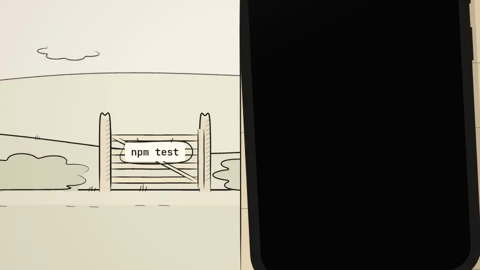
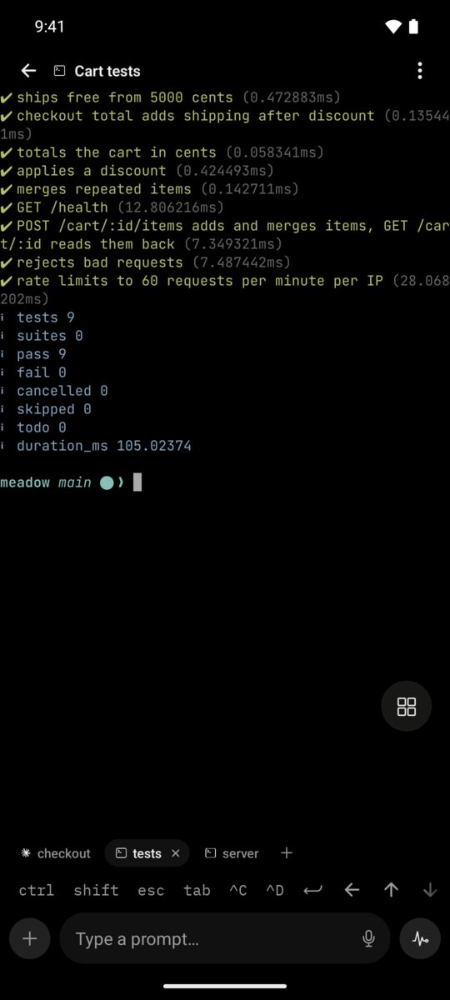
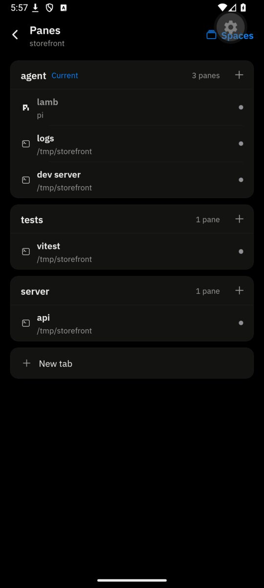
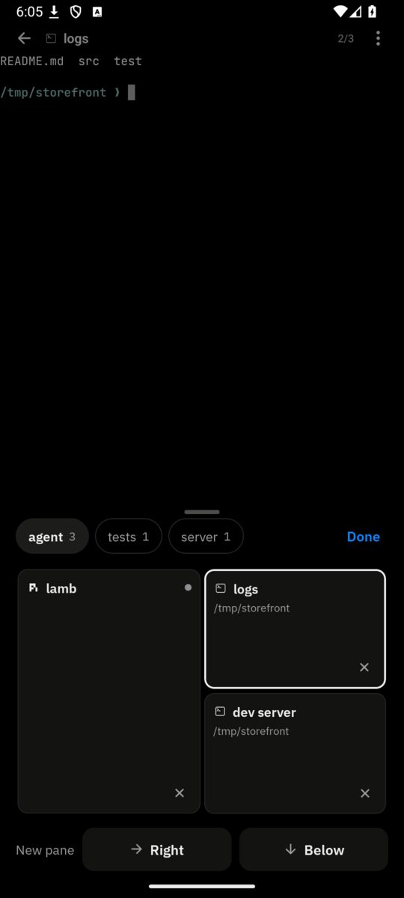
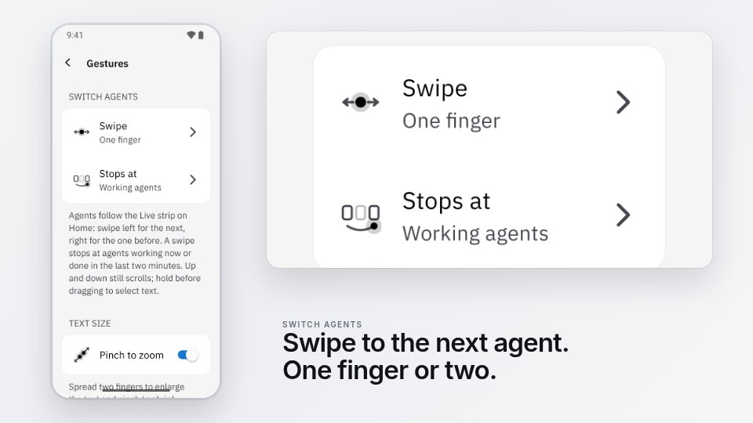
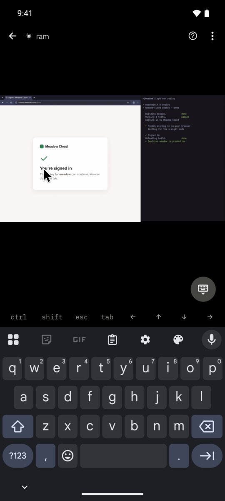
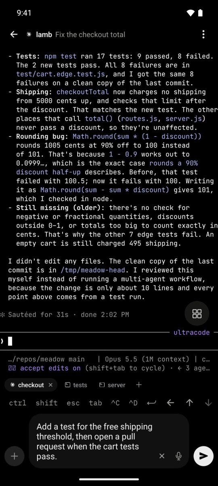

<h1 align="center">
  <a href="https://trymuxr.com"></a> muxr
</h1>

<p align="center">
  <a href="https://www.npmjs.com/package/@trymuxr/cli"></a>
  <a href="https://github.com/umeranjum17/muxr/actions/workflows/ci.yml"></a>
  <a href="LICENSE"></a>
  
</p>

<p align="center">
  <strong>Every agent. The real terminal. In your pocket.</strong><br/>
  muxr is a mobile-first client for the coding agents running on your computers. See the whole herd at a glance — who's working, who needs you, who's done. Open any agent's exact live terminal, prompt it like you're at the desk, and watch it keep executing on your machine. Not a dashboard about your agents — the same session, built for a thumb.
</p>

<h3 align="center"><a href="https://trymuxr.com/docs/quickstart"><ins>Get muxr</ins></a></h3>

<p align="center">
  <a href="https://play.google.com/apps/testing/com.trymuxr.app">Google Play testing</a> ·
  <a href="https://testflight.apple.com/join/aJSbs8pN">iOS TestFlight</a> ·
  <a href="https://trymuxr.com/downloads/stable/android">Download the Android APK</a> ·
  <a href="https://trymuxr.com/downloads">Stable and nightly</a>
</p>

<p align="center">
  <br/>
  <a href="docs/demo/muxr-the-gate-16x9.mp4">The launch film (42 s, MP4)</a>
</p>

## Why muxr exists

Coding agents made programming asynchronous: they work for minutes or hours, then stop and wait for you. Your phone is where you already are during those waits — but a terminal squeezed into a phone browser is unusable, and a notification app cannot actually answer.

muxr is the control surface built natively for the phone: the full agent lifecycle on one screen, the exact terminal when you tap in, and a prompt box that talks to the same session. Execution, code, credentials, and model subscriptions stay on your computers.

## See it in action

### A real terminal, built for thumbs

Open the same live terminal the agent owns on your computer, with native Ghostty rendering, scrollback, and sticky modifier keys. A floating control and a key row you can reorder keep actions within reach, and the composer keeps attachments and dictation beside the prompt. When a blocked Claude Code or Codex agent shows numbered answers, tap one instead of finding its key. Tap a printed link to open, copy, or insert it into the prompt.

<p align="center">
  <a href="https://trymuxr.com/#demo"><picture><source srcset="docs/assets/readme/terminal.webp" type="image/webp"></picture></a>
</p>

### Every agent, every machine

The Herd groups agents by repository and nests spawned workspaces when their lineage is declared. A nested workspace with one named agent shows that Herdr name before its workspace label, so you can pick the right agent; unnamed or multi-agent workspaces keep their workspace label. See real terminal thumbnails and agent lifecycle: working, needs you, done. Tap any agent and you are back in the same session.

<p align="center">
  <picture><source srcset="docs/assets/readme/herd.webp" type="image/webp"></picture>
</p>

### One workspace, every tab

The row above the composer lists the workspace's tabs, so the agent, its tests and its dev server are one tap apart, and + opens a new tab on your computer.

<p align="center">
  <picture><source srcset="docs/assets/readme/tabs.webp" type="image/webp"></picture>
</p>

### Every pane in the workspace

The workspace's panes as one live tree: each tab is a card with its panes under it, the tab you are in is marked Current, a shell shows its folder, and a pane that needs you pulses red. Tap a pane to open it, and add a pane or a whole tab right from the tree.

<p align="center">
  <picture><source srcset="docs/assets/readme/panes.webp" type="image/webp"></picture>
</p>

### Arrange panes like the desk

The pane counter in an agent's header tells you where you are in the tab, and tapping it lays the tab out as the desk has it — the same splits your computer shows, with the open pane outlined. Tap a tile to switch panes, or split Right or Below to make room, all without leaving the phone.

<p align="center">
  <picture><source srcset="docs/assets/readme/pane-sheet.webp" type="image/webp"></picture>
</p>

### Swipe between agents

Swipe sideways with one finger to move to the next working, waiting, or just-finished agent; the next terminal follows your finger. In **Settings → Gestures**, switch to a two-finger swipe or turn swiping off, choose which agents a swipe stops at, and turn pinch-to-zoom on or off. Vertical drags still scroll, and a resting finger still selects text.

<p align="center">
  <picture><source srcset="docs/assets/readme/gestures.webp" type="image/webp"></picture>
</p>

### Know who needs you

Home puts the agents waiting on you first, then the ones that finished while you were away, across every repository, and a notification reaches you when one stops. Open the waiting agent directly instead of hunting through terminals.

<p align="center">
  <picture><source srcset="docs/assets/readme/inbox.webp" type="image/webp"></picture>
</p>

### Review before it ships

Open the real diff and read every changed line in the working tree, the index, or the whole branch before you tell the agent to ship it, without waiting to get back to your desk.

<p align="center">
  <picture><source srcset="docs/assets/readme/changes.webp" type="image/webp"></picture>
</p>

### Peek at your computer

Tap **Computer** inside an agent's conversation to see your own desktop live and check what the agent is doing. On a machine with a desktop session, an agent can open a sign-in or CAPTCHA page in that desktop's browser for you to finish through Computer. Tap in to take over: the pointer follows your finger, with a keyboard and a shared clipboard. Remote desktop works over Tailscale, any mesh VPN or LAN address, or SSH alone, including on a cloud server; agent-opened pages on a screenless server are not automatically routed to its virtual display. [Routes and setup →](docs/SELF-HOSTING.md#remote-desktop-on-a-cloud-server)

<p align="center">
  <picture><source srcset="docs/assets/readme/computer.webp" type="image/webp"></picture>
</p>

### Talk to the herd

Use native realtime speech-to-speech when typing is the slow part. Ask what changed, give a follow-up, and keep the same agent context.

[Voice setup →](docs/VOICE-SETUP.md)

<p align="center">
  <picture><source srcset="docs/assets/readme/voice.webp" type="image/webp"></picture>
</p>

### Dictate the prompt

Tap the mic in the composer and speak. In the app, speech is transcribed on your phone as you talk, and the words land in the prompt for you to check before sending. Tap Stop to finish; during transcription, Cancel is on the opposite side so a second stop tap cannot discard your words. If you cancel, tap Undo within five seconds to restore them.

<p align="center">
  <picture><source srcset="docs/assets/readme/dictation.webp" type="image/webp"></picture>
</p>

**Also on your phone:**

- **New agents and worktrees** — open the home composer to choose the machine, repository, worktree, and one of 20+ agent CLIs. The resting dock hides Send until there's a draft or a submission in progress. On a short phone, scroll the open composer to reach its options and Start when the keyboard is visible. On a later launch, Home can show the last confirmed agents and spaces while reconnecting; they appear dimmed until the host responds, and closing a remembered space is unavailable.
- **Files, attachments, and changes** — inspect repository files, diffs, and agent outputs from your phone; download an agent's Shared Artifacts with progress and resume after a lost connection. On web, a download finished in the background offers **Save** when you return.
- **Settings** — under Appearance, choose a theme and terminal text size; the browser terminal also offers System or IBM Plex Mono. Gestures lists terminal actions and the swipe and zoom choices. Under Notifications, choose alerts for agents needing you or finishing; enable browser notifications in the web app or manage permission and sound in your phone's system settings.
- **Usage** — see each plan window's percent left, reset time, and pace when known; Home shows every connected plan's limits at a glance, each plan's mark over what is left of its windows, alongside machine health.
- **Desktop control (Linux)** — see **Peek at your computer** above. Remote desktop needs a Linux x64 host today (macOS later; Arm servers build the engine from source), and a cloud server needs the virtual-display packages once. Android and web have desktop clients; on iPhone, open Computer in the web app (native iOS support is not yet available). [Remote desktop setup and limits](docs/SELF-HOSTING.md#remote-desktop-on-a-cloud-server) · [Host engine](https://github.com/umeranjum17/desklink/blob/main/packages/desktop-host/README.md)
- **[Extensions](https://trymuxr.com/docs/plugins)** — add phone-native controls and screens without forking the app.

The [release history](https://github.com/umeranjum17/muxr/releases) is the real feature list.

## The whole party, in one place

Parallel agents work like a party: each has a job, a state, and moments when it needs you. muxr keeps the real terminals, diffs, inbox, and voice together without hiding what is happening.


## Your machines, your relay

Your phone and computer stay connected over Wi-Fi, Tailscale, any mesh VPN, SSH alone, or a VPS you run. Pair once and every route carries your agents, terminals, and desktop. Nobody else runs your agents.

Terminal text, prompts, responses, keystrokes, files, pairing secrets, and credentials remain end-to-end encrypted. Agents, repositories, model subscriptions, and encryption keys stay on your computer.

[Privacy and trust →](https://trymuxr.com/docs/privacy) · [Self-hosting →](docs/SELF-HOSTING.md)

## Install

You need [Node.js 22 or newer](https://nodejs.org/) on Linux, macOS, or WSL. muxr installs [Herdr](https://herdr.dev) during setup if it is missing.

```bash
npm install -g --ignore-scripts @trymuxr/cli@latest
muxr
```

Want the newest build? Install it with `npm install -g --ignore-scripts @trymuxr/cli@nightly` and take its APK from the [nightly channel](https://trymuxr.com/downloads/nightly). The **Android app** installs alongside a stable one rather than replacing it, so you can keep both on the phone. On your computer both channels are the same CLI, so switching npm tags replaces the host you already run rather than adding a second one. Beta and dev are retired: moving across is that one install, and an older binary will not upgrade itself to a `-nightly` version.

Then install the mobile companion:

- **Android (stable):** [download the stable APK](https://trymuxr.com/downloads/stable/android) · [stable checksum](https://trymuxr.com/downloads/stable/checksums)
- **Google Play testing:** [join the testing track](https://play.google.com/apps/testing/com.trymuxr.app) — availability depends on Google review and testing access
- **iOS TestFlight:** [open the public link](https://testflight.apple.com/join/aJSbs8pN) — build availability depends on Apple review and tester capacity. Store tracks review and roll out on their own schedule, so they do not move with the nightly APK
- **Web:** pair an eight-hour control or view-only browser during self-hosted setup. On compact screens, Home opens running agents and a control grant adds the bottom composer to start one, instead of bottom tabs. Search, Panes, and Settings live in the header; Usage opens from Home or Settings.
- **All builds:** [every download channel](https://trymuxr.com/downloads)

Save the channel's checksum next to the downloaded APK as `SHA256SUMS`, verify it with `sha256sum --ignore-missing -c SHA256SUMS`, then run `muxr`. Each channel publishes its own checksum, so verify against the channel you downloaded from. Setup shows six routes with their requirements, recommends a ready route, and changes nothing until **Apply setup**. Scan the one-use QR from the phone when it is ready.

[Read the step-by-step quickstart →](https://trymuxr.com/docs/quickstart)

## Use the agents you already have

muxr connects to sessions [Herdr](https://github.com/herdrdev/herdr) already runs. Your CLIs, subscriptions, configuration, skills, and MCP servers stay as they are. muxr never edits agent instruction files; load the compact `muxr --skill`, then request one focused topic with `muxr skill <topic>` only when needed.

<p align="center">
  
  
</p>

## Extensions

Add phone-native controls, screens, files, diffs, metrics, shortcuts, and realtime streams through the public extension API.

[Extension guide →](https://trymuxr.com/docs/plugins)

## Development

```bash
git clone https://github.com/umeranjum17/muxr
cd muxr
yarn install --frozen-lockfile
yarn typecheck
yarn run check
```

See [CONTRIBUTING.md](CONTRIBUTING.md) for development setup and pull requests.

## License

muxr is licensed under [Apache License 2.0](LICENSE). Third-party notices are recorded in [NOTICE](NOTICE) and the [license inventory](docs/license-inventory.md). The muxr name and marks are covered by [TRADEMARK.md](TRADEMARK.md).

## Development and nightly builds

Merging into `main` advances development, not production. Use the [release channel workflow](docs/RELEASING.md) for signed nightly APKs, verified npm artifacts and explicit stable promotion. Emulator acceptance stays local.
