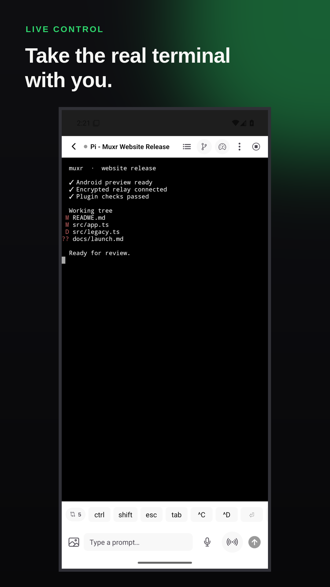
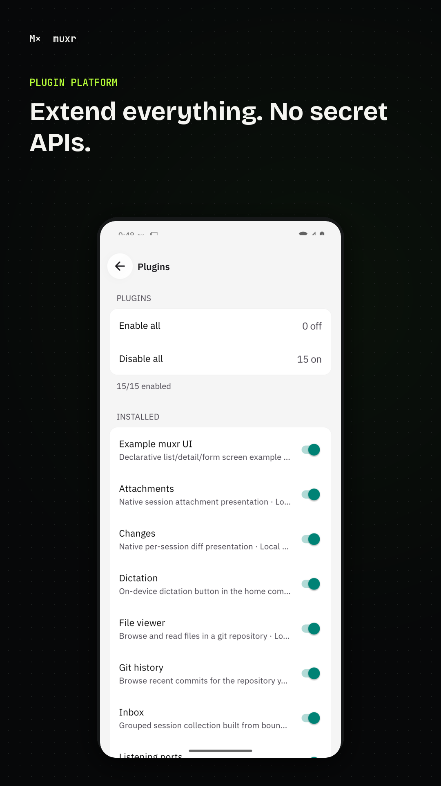

# muxr

Drive every coding agent on your machine — Pi, Claude Code, Codex, Cursor, and 17 more — from your phone or browser through [herdr](https://herdr.dev), without moving anything off your machine.

> **Fully open source:** this repository is the complete product—CLI, relay,
> mobile app, pairing, encryption, and plugin platform. Run it yourself, modify
> it, and extend it under Apache-2.0.

> **Security:** terminal and session traffic is end-to-end encrypted (v2 machine
> keys) whenever E2EE is on — the secure default outside the explicit loopback development fixture.
> The relay routes ciphertext it cannot read. The explicit source development
> fixture may run cleartext; normal relays do not.

<p align="center">
  
  
  
</p>

## What it does

- **Herd overview:** see every active agent, workspace, tab, and pane at a glance.
- **Real terminals:** render the agent's actual TUI, send keys, scroll, split panes,
  and single-swipe between working or just-finished agents without paging through
  old shells.
- **Attention inbox:** surface blocked agents and answer approvals from your phone.
- **Changes and attachments:** inspect per-run git changes and receive screenshots,
  APKs, exports, and other artifacts from the pane that produced them.
- **Start agents and squads:** choose an agent, directory, optional worktree, or
  start several agents together.
- **Voice:** start an explicit provider-neutral realtime conversation through a
  backend plugin, or dictate editable text locally with bundled Whisper Base
  English. Provider credentials stay on the host; dictation audio never leaves
  the phone.
- **Local host bridge:** your machine remains the source of truth and runs the
  agents under your user. Connect over your network, Tailscale, a tunnel, or SSH.

## Architecture

```text
PHONE / WEB             RELAY                 YOUR MACHINE
apps/mobile      <----> apps/relay      <----> apps/host      <----> herdr
terminal + UI           routes bytes           translates            owns PTYs
```

The relay routes ciphertext it cannot read: session envelopes and terminal
frames are v2 end-to-end encrypted whenever E2EE is on (the secure default
outside the explicit source development fixture). The host translates herdr's socket
and terminal streams into the shared contract. The app renders and stores local
presentation state; it does not own agent lifecycle state.

See [Architecture](docs/ARCHITECTURE.md) for the full data flow and ownership
boundaries. muxr ships a Pi-like plugin platform: one host-installed package
can combine Herdr backend hooks with declarative native mobile contributions. See
[Build a muxr plugin](docs/PLUGINS.md).

## Quick start

Requires Linux, macOS, or WSL and Node.js 22 or newer.

```bash
npm install -g @trymuxr/cli
muxr setup
```

`muxr setup` installs or adopts Herdr with consent, syncs detected coding-agent
integrations, starts the complete self-hosted relay and host, then displays a
short-lived pairing QR. Voice and Run Server are optional bundled plugins using
the same public API as every
third-party plugin.

Install the signed phone app from the [latest GitHub release](https://github.com/umeranjum17/muxr/releases/latest). Prefer a browser? `muxr self-host --web` serves the read-only web client from your machine.

## Development

Clone the repository, run `yarn install --frozen-lockfile`, then start the development relay and host:

```bash
yarn up
```

`yarn up` prints the relay URL, machine id, and development-only scoped account credential needed by
the app. Strict paired traffic uses scoped credentials only to mint short-lived one-use WebSocket tickets. It uses the real herdr server; for UI work without herdr, run the relay
and scripted host separately:

```bash
MUXR_RELAY_HOST=127.0.0.1 node apps/relay/dist/main.js
node apps/host/dist/main.js --fake
```

Start the web app in another terminal using the connection values printed by
`yarn up`:

```bash
cd apps/mobile
EXPO_PUBLIC_MUXR_MODE=local \
EXPO_PUBLIC_MUXR_RELAY_URL=ws://127.0.0.1:8792 \
EXPO_PUBLIC_MUXR_MACHINE_ID=devbox \
EXPO_PUBLIC_MUXR_TOKEN=<account-token-if-shown> \
  yarn web
```

Open <http://localhost:8081>, create the local account, and select the machine.
A physical phone must use the host's LAN or HTTPS address—not `127.0.0.1`.
Run `yarn doctor` when the stack does not connect.

## Self-hosting and native builds

- [Self-hosting](docs/SELF-HOSTING.md): run your own relay, pair via QR or
  pairing string, and Tailscale/Cloudflare Tunnel/SSH connectivity.
  The relay also has a [Dockerfile](Dockerfile) (`docker compose up` runs it).
- [Native Android build](docs/NATIVE-BUILD.md): JDK/SDK/NDK requirements and the
  local arm64 APK build. Android builds are local; the project does not spend
  cloud EAS build credits. **Expo Go will not work** — the app uses custom native
  modules and `patch-package`.
- [Voice setup](docs/VOICE-SETUP.md): provider-neutral realtime voice, backend
  plugin credentials, local Whisper dictation, and platform boundaries.
- [Build a muxr plugin](docs/PLUGINS.md): package shape, native hooks,
  components, data, actions, notifications, trust, and the author loop.
- [Docs index](docs/README.md): architecture, ADRs, specs, and setup guides.
- [Contributing](CONTRIBUTING.md): development rules and verification commands.
- [Security](SECURITY.md): report a vulnerability privately; what is and is not in scope.
- [Governance](GOVERNANCE.md) and [Code of conduct](CODE_OF_CONDUCT.md).

## Configuration

### Relay

| Variable | Default | Purpose |
|---|---|---|
| `MUXR_RELAY_DEVELOPMENT_API` | `0` | Set to `1` only for the loopback development fixture; normal relays use strict auth and E2EE |
| `MUXR_RELAY_LOCAL_AUTHORITY` | `1` | File-backed pairing, revocation, and one-use ticket authority |
| `MUXR_RELAY_PUBLIC_EDGE` | `0` | Public-edge HTTP hardening for an embedding process |
| `MUXR_RELAY_HOST` | `127.0.0.1` | Relay bind address |
| `MUXR_RELAY_PORT` | `8792` | Relay port |
| `MUXR_RELAY_DATA_DIR` | `~/.muxr/relay` | Relay state (tickets, registry, buffers) |
| `MUXR_RELAY_E2EE` | `on` | `off` is accepted only by the explicit development API |
| `MUXR_TRUST_PROXY` | off | `1` when behind cloudflared/nginx so rate limits key on real client IPs |

Self-hosting is the product, not a reduced tier. See [docs/SELF-HOSTING.md](docs/SELF-HOSTING.md).

### Host

| Variable | Purpose |
|---|---|
| `MUXR_MODE` | Strict paired mode is inferred from valid self-host setup state; `local` is an explicit development fixture |
| `MUXR_MACHINE_ID` | Local fixture override; paired setup owns the machine id |
| `MUXR_RELAY_URL` | Local fixture override; paired setup owns relay discovery |
| `MUXR_RELAY_TOKEN` | Local/support override; paired setup stores the scoped machine credential owner-only |
| `MUXR_E2EE_SHARED_KEY` | Explicit local legacy fixture only; strict paired startup rejects it |

### App build

| Variable | Purpose |
|---|---|
| `EXPO_PUBLIC_MUXR_MODE` | Strict paired mode (default) or explicit `local` development fixture |
| `EXPO_PUBLIC_MUXR_RELAY_URL` | Initial relay origin or local fixture URL; the paired relay remains editable in Settings |
| `EXPO_PUBLIC_MUXR_MACHINE_ID` | Local fixture default only; pairing selects the machine |
| `EXPO_PUBLIC_MUXR_TOKEN` / `EXPO_PUBLIC_MUXR_E2EE_KEY` | Local fixture only; ignored and scrubbed in strict paired mode |
| `MUXR_APP_ID_BASE` | Optional validation override; production is permanently `com.trymuxr.app` |
| `MUXR_PUBLIC_BASE_URL` | Owner-controlled HTTPS origin for activation and verified links; required for production |
| `MUXR_EAS_PROJECT_ID` | Optional EAS project association; no inherited project is hard-coded |

Development uses the reserved local identifier `app.muxr.local.dev`; preview
uses `app.muxr.local.preview`. Production is permanently `com.trymuxr.app` and
fails configuration until the owner supplies the publishing HTTPS origin.
Connection values are baked into the bundle and remain editable under Settings →
Connection.

### Setup safety

If herdr is missing, interactive `muxr setup` asks before downloading its
installer and defaults to No; non-interactive use requires `--install-herdr`.
Set `MUXR_HERDR_INSTALLER` to an executable reviewed local installer to avoid
remote installer execution.

muxr state lives under `~/.muxr` unless `MUXR_HOME` is set; environment variables use the `MUXR_*` prefix.

## Development checks

```bash
yarn typecheck
npx vitest run
node packages/contract/dist/selfCheck.js
node scripts/runSuite.mjs  # includes the clean npm-package smoke flow
```

For contract or relay changes, also run the live fake-host probe:

```bash
node apps/probe/dist/main.js
```

For native changes, run `node scripts/verifyNativePatches.mjs` before building.

## Repository layout

```text
apps/host          herdr bridge, changes, attachments
apps/relay         session envelopes, plaintext dev terminal/preview routing, push
apps/mobile        Expo web and native app
apps/probe         live contract/relay probe
packages/wire      private app wire schemas
packages/contract  host/mobile contract
packages/crypto    E2EE payload codec
plugins            bundled Herdr + muxr UI plugins
scripts            development, verification, and build tools
docs               architecture and setup guides
Dockerfile         self-host relay image (`docker compose up`)
```

## Support

Bug reports and focused feature requests are welcome in [GitHub Issues](https://github.com/umeranjum17/muxr/issues). Community support is best-effort; no response-time or resolution SLA is offered.

## License

muxr product code is licensed under [Apache License 2.0](LICENSE).
Third-party and inherited code keeps its original license and copyright notices
in [NOTICE](NOTICE), [LICENSES](LICENSES/), and the
[distribution inventory](docs/license-inventory.md).
