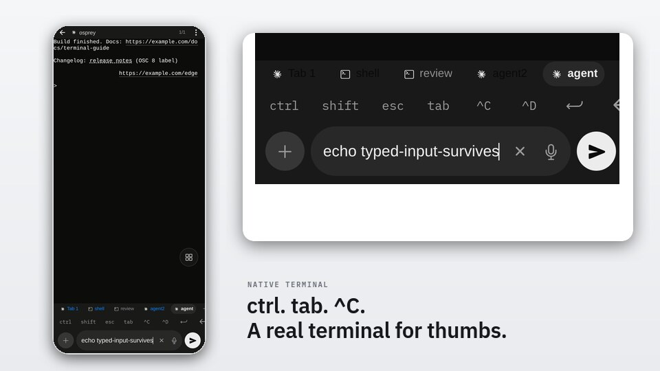
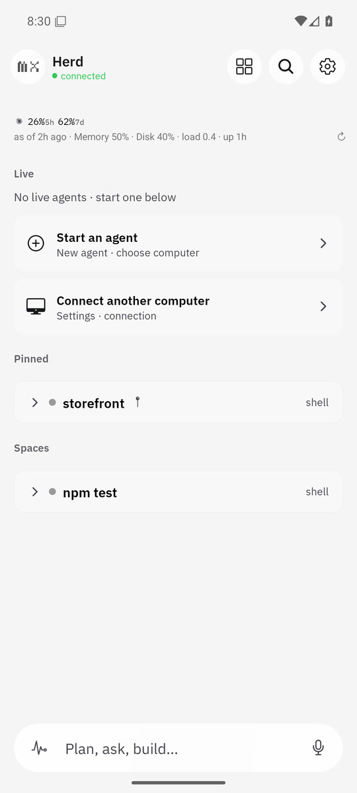
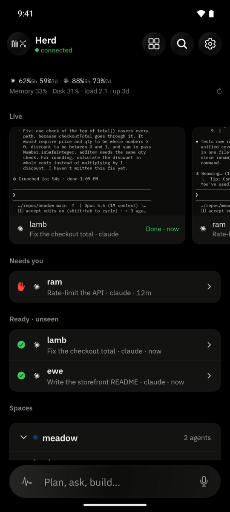
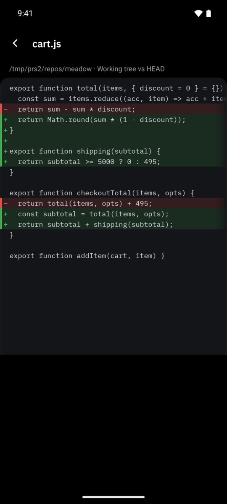
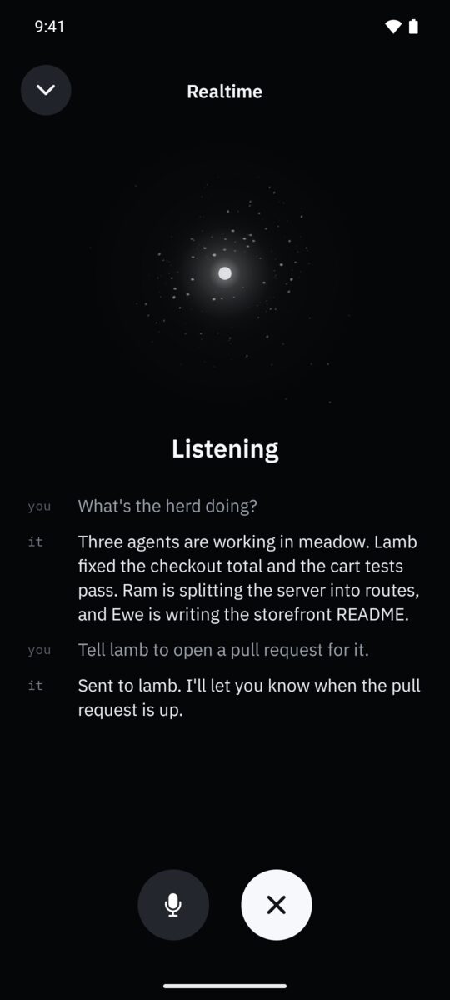
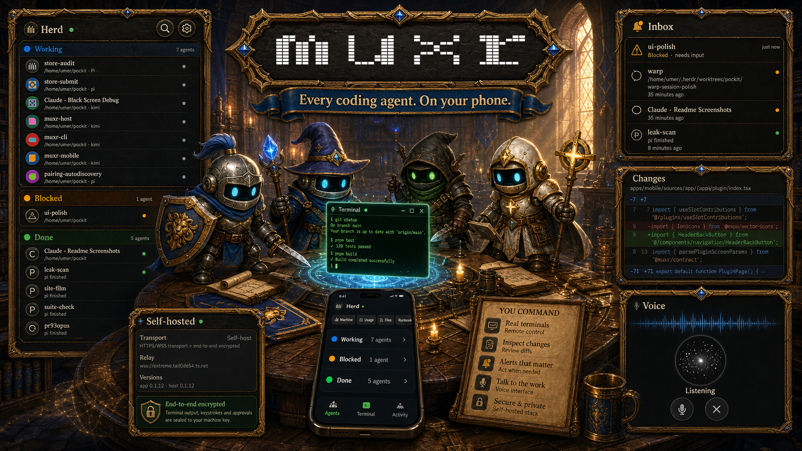

<h1 align="center">
  <a href="https://trymuxr.com"></a> muxr
</h1>

<p align="center">
  <a href="https://www.npmjs.com/package/@trymuxr/cli"></a>
  <a href="https://github.com/umeranjum17/muxr/actions/workflows/ci.yml"></a>
  <a href="LICENSE"></a>
  
</p>

<p align="center">
  <strong>Every agent. The real terminal. In your pocket.</strong><br/>
  muxr is a mobile-first client for the coding agents running on your computers. See the whole herd at a glance — who's working, who needs you, who's done. Open any agent's exact live terminal, prompt it like you're at the desk, and watch it keep executing on your machine. Not a dashboard about your agents — the same session, built for a thumb.
</p>

<h3 align="center"><a href="https://trymuxr.com/docs/quickstart"><ins>Get muxr</ins></a></h3>

<p align="center">
  <a href="https://play.google.com/apps/testing/com.trymuxr.app">Google Play testing</a> ·
  <a href="https://testflight.apple.com/join/aJSbs8pN">iOS TestFlight</a> ·
  <a href="https://github.com/umeranjum17/muxr/releases/download/v0.1.22/muxr-android-0.1.12-build47.apk">Direct APK: 0.1.12 (build 47)</a> ·
  <a href="https://github.com/umeranjum17/muxr/releases/tag/v0.1.22">Release 0.1.22</a>
</p>

<p align="center">
  
</p>

## Why muxr exists

Coding agents made programming asynchronous: they work for minutes or hours, then stop and wait for you. Your phone is where you already are during those waits — but a terminal squeezed into a phone browser is unusable, and a notification app cannot actually answer.

muxr is the control surface built natively for the phone: the full agent lifecycle on one screen, the exact terminal when you tap in, and a prompt box that talks to the same session. Execution, code, credentials, and model subscriptions stay on your computers.

## See it in action

<table>
<tr>
<td width="45%" valign="middle">

### A real terminal, built for thumbs

Open the same live terminal the agent owns on your computer — native Ghostty rendering, scrollback, modifier keys, attachments, dictation, and a prompt box designed for a phone.

</td>
<td width="55%">
  <a href="https://trymuxr.com/#demo"><picture><source srcset="docs/assets/readme/terminal.webp" type="image/webp"></picture></a>
</td>
</tr>
<tr>
<td width="45%" valign="middle">

### Every agent, every machine

The Herd groups agents by repository and shows their real terminal thumbnails and lifecycle: working, needs you, done. Tap any one and you are back in the same session.

</td>
<td width="55%">
  <picture><source srcset="docs/assets/readme/herd.webp" type="image/webp"></picture>
</td>
</tr>
<tr>
<td width="45%" valign="middle">

### Know who needs you

Inbox collects attention across every repository. Open the waiting agent directly instead of hunting through terminals or notification history.

</td>
<td width="55%">
  <picture><source srcset="docs/assets/readme/inbox.webp" type="image/webp"></picture>
</td>
</tr>
<tr>
<td width="45%" valign="middle">

### Review before it ships

Open the real diff, inspect every changed line, then accept or reject it without waiting to get back to your desk.

</td>
<td width="55%">
  <picture><source srcset="docs/assets/readme/changes.webp" type="image/webp"></picture>
</td>
</tr>
<tr>
<td width="45%" valign="middle">

### Talk to the herd

Use native realtime speech-to-speech when typing is the slow part. Ask what changed, give a follow-up, and keep the same agent context.

[Voice setup →](docs/VOICE-SETUP.md)

</td>
<td width="55%">
  <picture><source srcset="docs/assets/readme/voice.webp" type="image/webp"></picture>
</td>
</tr>
</table>

**Also on your phone:**

- **New agents and worktrees** — choose the machine, repository, worktree, and one of 20+ agent CLIs from the home composer.
- **Files, attachments, ports, and previews** — inspect outputs or open the dev server an agent just started.
- **Usage, runbooks, and [extensions](https://trymuxr.com/docs/plugins)** — add phone-native controls and screens without forking the app.

The [release history](https://github.com/umeranjum17/muxr/releases) is the real feature list.

## The whole party, in one place

Parallel agents work like a party: each has a job, a state, and moments when it needs you. muxr keeps the real terminals, diffs, inbox, and voice together without hiding what is happening.



## Your machines, your relay

Your phone and computer stay connected over Wi-Fi, Tailscale, or a VPS you run. Nobody else runs your agents.

Terminal text, prompts, responses, keystrokes, files, pairing secrets, and credentials remain end-to-end encrypted. Agents, repositories, model subscriptions, and encryption keys stay on your computer.

[Privacy and trust →](https://trymuxr.com/docs/privacy) · [Self-hosting →](docs/SELF-HOSTING.md)

## Install

You need [Node.js 22 or newer](https://nodejs.org/) on Linux, macOS, or WSL. muxr installs [Herdr](https://herdr.dev) during setup if it is missing.

```bash
npm install -g --ignore-scripts @trymuxr/cli@0.1.22
muxr
```

Then install the mobile companion:

- **Android:** [join Google Play testing](https://play.google.com/apps/testing/com.trymuxr.app) · [download the signed APK (0.1.12 build 47)](https://github.com/umeranjum17/muxr/releases/download/v0.1.22/muxr-android-0.1.12-build47.apk) · [SHA256SUMS](https://github.com/umeranjum17/muxr/releases/download/v0.1.22/SHA256SUMS)
- **iOS:** [open the public TestFlight link](https://testflight.apple.com/join/aJSbs8pN) — Apple is not accepting new testers right now
- **Web:** pair an eight-hour read-only browser during self-hosted setup
- **All builds:** [muxr 0.1.22 release](https://github.com/umeranjum17/muxr/releases/tag/v0.1.22)

Verify a downloaded APK with `sha256sum --ignore-missing -c SHA256SUMS`, then run `muxr`, choose **Apply setup**, and scan the one-use QR from the phone. Start with LAN when both devices are on the same Wi-Fi.

[Read the step-by-step quickstart →](https://trymuxr.com/docs/quickstart)

## Use the agents you already have

muxr connects to sessions [Herdr](https://github.com/herdrdev/herdr) already runs. Your CLIs, subscriptions, configuration, skills, and MCP servers stay as they are. muxr never edits agent instruction files; load the compact `muxr --skill`, then request one focused topic with `muxr skill <topic>` only when needed.

<p>
  
  
</p>

Pi · OMP · Claude Code · Codex · Gemini CLI · Cursor · OpenCode · GitHub Copilot CLI · Kimi Code · Grok · Hermes Agent · Amp · Factory Droid · Devin · Cline · Kiro · Kilo Code · Qoder CLI · Antigravity · MastraCode · Maki

## Extensions

Add phone-native controls, screens, files, diffs, metrics, shortcuts, and realtime streams through the public extension API.

[Extension guide →](https://trymuxr.com/docs/plugins) · [Bundled examples →](plugins/)

## Development

```bash
git clone https://github.com/umeranjum17/muxr
cd muxr
yarn install --frozen-lockfile
yarn typecheck
yarn run check
```

See [CONTRIBUTING.md](CONTRIBUTING.md) for development setup and pull requests.

## License

muxr is licensed under [Apache License 2.0](LICENSE). Third-party notices are recorded in [NOTICE](NOTICE) and the [license inventory](docs/license-inventory.md). The muxr name and marks are covered by [TRADEMARK.md](TRADEMARK.md).
