<h1 align="center">
  <a href="https://trymuxr.com"></a> muxr
</h1>

<p align="center">
  <a href="https://www.npmjs.com/package/@trymuxr/cli"></a>
  <a href="https://github.com/umeranjum17/muxr/actions/workflows/ci.yml"></a>
  <a href="LICENSE"></a>
  
</p>

<p align="center">
  <strong>Every agent. The real terminal. In your pocket.</strong><br/>
  muxr is a mobile-first client for the coding agents running on your computers. See the whole herd at a glance — who's working, who needs you, who's done. Open any agent's exact live terminal, prompt it like you're at the desk, and watch it keep executing on your machine. Not a dashboard about your agents — the same session, built for a thumb.
</p>

<h3 align="center"><a href="https://trymuxr.com/docs/quickstart"><ins>Get muxr</ins></a></h3>

<p align="center">
  <a href="https://play.google.com/apps/testing/com.trymuxr.app">Google Play testing</a> ·
  <a href="https://testflight.apple.com/join/aJSbs8pN">iOS TestFlight</a> ·
  <a href="https://trymuxr.com/downloads/stable/android">Download the Android APK</a> ·
  <a href="https://trymuxr.com/downloads">Stable and nightly</a>
</p>

<p align="center">
  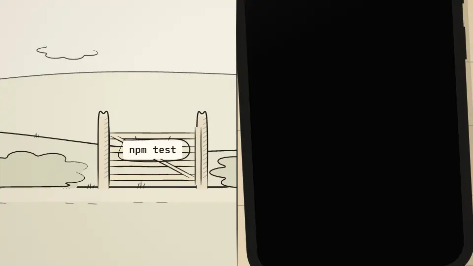<br/>
  <a href="docs/demo/muxr-the-gate-16x9.mp4">The launch film (42 s, MP4)</a>
</p>

## Why muxr exists

Coding agents made programming asynchronous: they work for minutes or hours, then stop and wait for you. Your phone is where you already are during those waits — but a terminal squeezed into a phone browser is unusable, and a notification app cannot actually answer.

muxr is the control surface built natively for the phone: the full agent lifecycle on one screen, the exact terminal when you tap in, and a prompt box that talks to the same session. Execution, code, credentials, and model subscriptions stay on your computers.

## See it in action

### A real terminal, built for thumbs

Open the same live terminal the agent owns on your computer, with native Ghostty rendering, scrollback, and sticky modifier keys. A floating control and a key row you can reorder keep actions within reach, and the composer keeps attachments and dictation beside the prompt. When a blocked Claude Code or Codex agent shows numbered answers, tap one instead of finding its key. Tap a printed link to open, copy, or insert it into the prompt.

After scrolling back, tap **Latest** to return toward the live output. Update the host alongside the app to use this control. **Still catching up** means the host has not established completion; tap again to retry. Typing, scrolling, or refreshing the terminal clears that pending feedback.

<p align="center">
  <a href="https://trymuxr.com/#demo"><picture><source srcset="docs/assets/readme/terminal.webp" type="image/webp">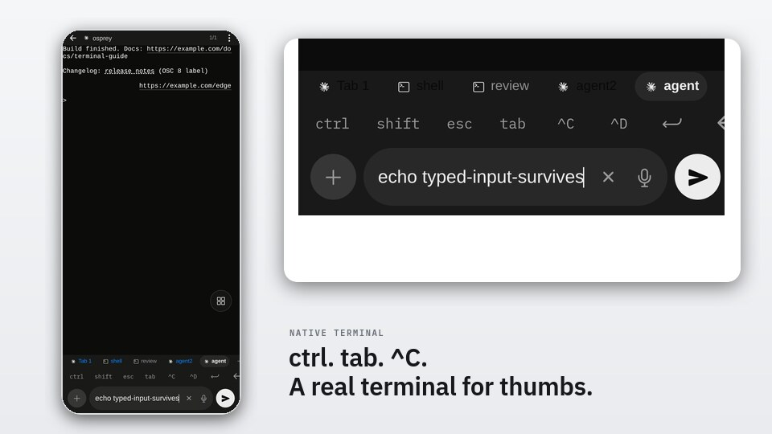</picture></a>
</p>

### Every agent, every machine

The Herd groups agents by repository and nests spawned workspaces when their lineage is declared. Every agent row leads with what that agent is working on, with its kind, Herdr name and state underneath (`pi · zulu-2 · Working`); an agent with no task to show leads with its name, and a nested workspace with none shows its workspace label. See real terminal thumbnails and agent lifecycle: working, needs you, done. Long-press a top-level space card and choose **Pin to top** to keep it above other spaces, or **Unpin** to return it to the ordinary list. Pins are saved on this device and retained across app restarts and machine switches; nested spaces remain inside their parent cards. Tap any agent and you are back in the same session.

<p align="center">
  <picture><source srcset="docs/assets/readme/herd.webp" type="image/webp">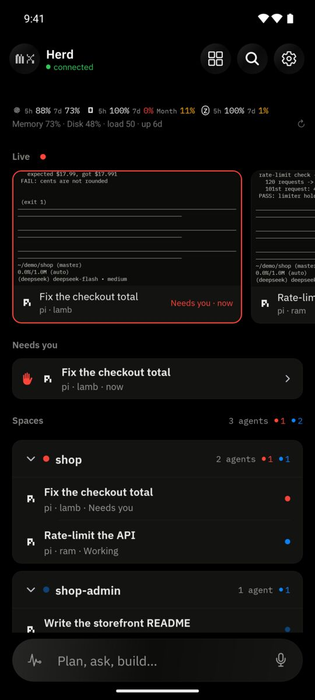</picture>
</p>

### One workspace, every tab

The row above the composer lists the workspace's tabs, so the agent, its tests and its dev server are one tap apart, and + opens a new tab on your computer.

<p align="center">
  <picture><source srcset="docs/assets/readme/tabs.webp" type="image/webp">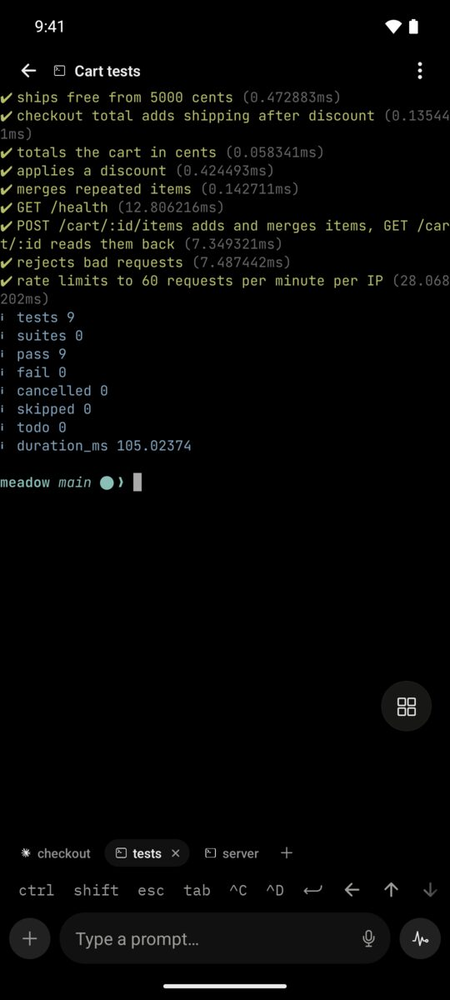</picture>
</p>

### Every pane in the workspace

The workspace's panes as one live tree: each tab is a card with its panes under it, the tab you are in is marked Current, a shell shows its folder, and a pane that needs you pulses red. Tap a pane to open it, and add a pane or a whole tab right from the tree.

<p align="center">
  <picture><source srcset="docs/assets/readme/panes.webp" type="image/webp">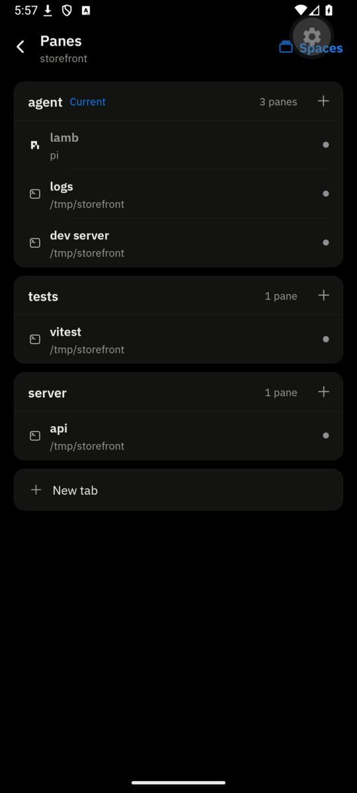</picture>
</p>

### Arrange panes like the desk

The pane counter in an agent's header tells you where you are in the tab, and tapping it — or the header title — lays the tab out as the desk has it — the same splits your computer shows, with the open pane outlined. Tap a tile to switch panes, or split Right or Below to make room, all without leaving the phone.

<p align="center">
  <picture><source srcset="docs/assets/readme/pane-sheet.webp" type="image/webp">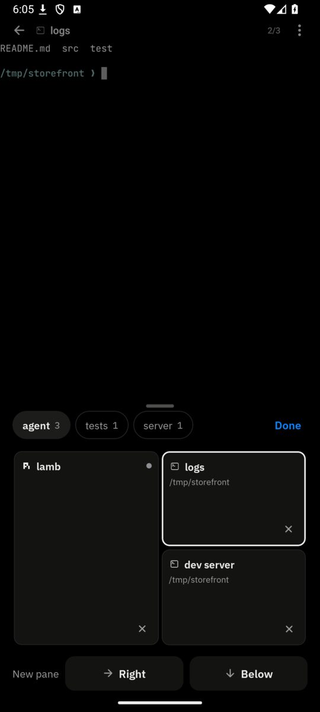</picture>
</p>

### Swipe between agents

Swipe sideways with one finger to move to the next working, waiting, or just-finished agent; the next terminal follows your finger. In **Settings → Gestures**, switch to a two-finger swipe or turn swiping off, choose which agents a swipe stops at, and turn pinch-to-zoom on or off. Vertical drags still scroll, and a resting finger still selects text.

<p align="center">
  <picture><source srcset="docs/assets/readme/gestures.webp" type="image/webp">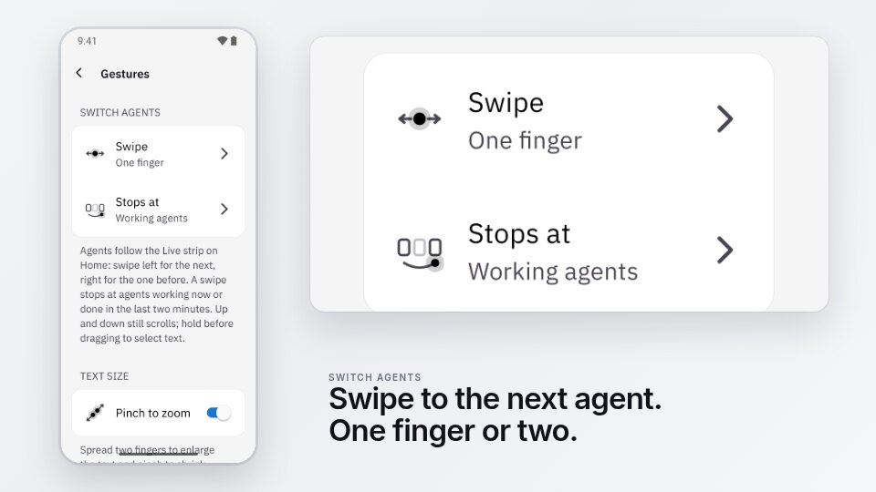</picture>
</p>

### Know who needs you

Home puts the agents waiting on you first, then the ones that finished while you were away, across every repository, and a notification reaches you when one stops. Open the waiting agent directly instead of hunting through terminals.

<p align="center">
  <picture><source srcset="docs/assets/readme/inbox.webp" type="image/webp">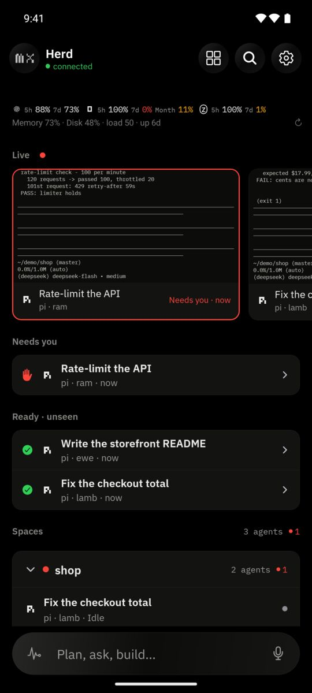</picture>
</p>

### Know your limits

See what's left in each plan window, when it resets, and whether you're on pace to run out — Home and a plan's Usage tab show the same numbers — and how many tokens each agent spent, with trends, top models, and what they cost.

<p align="center">
  <picture><source srcset="docs/assets/readme/usage.webp" type="image/webp">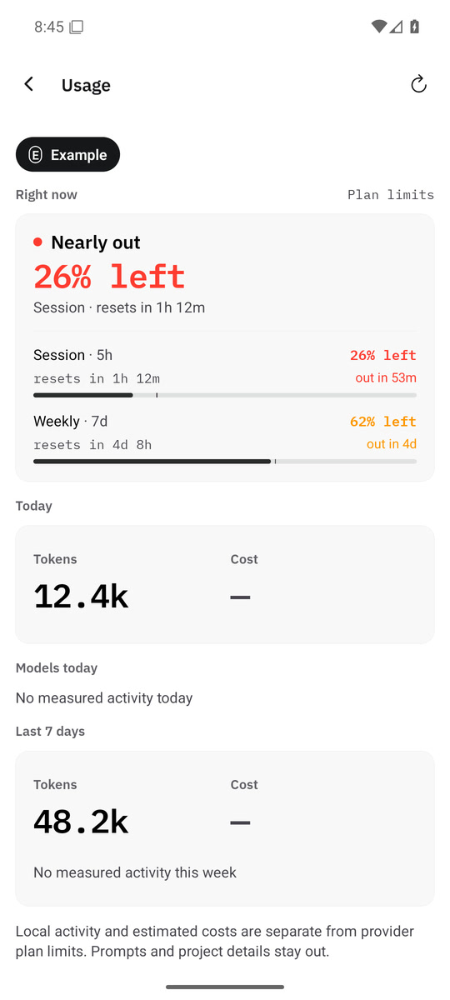</picture>
</p>

### Switch between subscription accounts

Open **Settings → Accounts** to add a Claude or ChatGPT (Codex) account on the connected computer. muxr opens the provider's own sign-in in a new tab, using a private folder for the added account. Finish signing in there; muxr closes the tab and asks you to name the account. The folder shares conversation history with the computer's main sign-in so conversations can resume across accounts; credentials stay in the provider's folder on your computer.

With two or more accounts for the selected provider, the new-agent dock shows an **Account** row under Agent. Open it to choose a named account or **Auto**, which picks the signed-in account with the most room left at launch and explains its pick. Signed-out accounts offer **Sign in** and are never picked. Auto shows a one-time note that it may use either account; it does not rotate accounts during a conversation. With one account per provider, the dock and Agent picker stay as before and launches carry no account choice.

If a saved account is no longer signed in, the dock falls back to Auto. With Auto off, it prefers the computer's signed-in account, then another signed-in account if available. If an account signs out after selection but before launch, the host uses the computer's own sign-in. Starting waits for initial account discovery; a temporary discovery failure blocks a saved or Auto choice until accounts can be checked.

In a running agent's menu, choose **Move to another account**. The sheet marks the current account **Now** and preselects the signed-in alternative with the most room left. Claude Code, Codex and Pi can resume a published conversation in the same tab; moving stops the current step, and the new account reads the conversation once from the start. A **Moved to X** notice confirms the change.

**Settings → Accounts** also lets you rename accounts, sign in again, remove added accounts, and turn Auto off to keep the last chosen account. The computer's own sign-in is marked **found on this computer** and cannot be removed here. Removing an added account deletes its private sign-in folder; shared conversation history stays.

### Review before it ships

Open the real diff and read every changed line in the working tree, the index, or the whole branch before you tell the agent to ship it, without waiting to get back to your desk.

<p align="center">
  <picture><source srcset="docs/assets/readme/changes.webp" type="image/webp">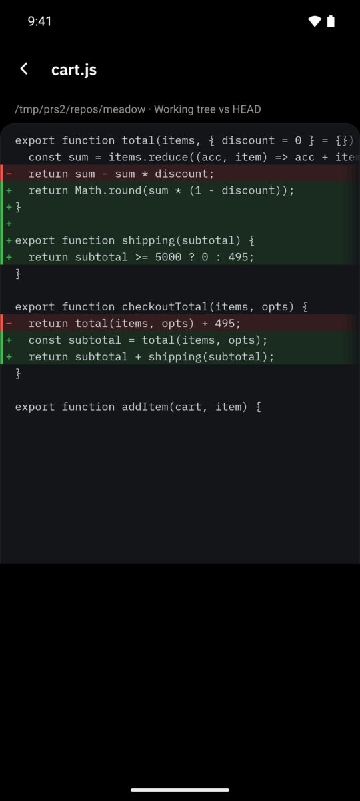</picture>
</p>

### Peek at your computer

Tap **Computer** inside an agent's conversation to see your own desktop live and check what the agent is doing. On a machine with a desktop session, an agent can open a sign-in or CAPTCHA page in that desktop's browser for you to finish through Computer. A muxr-launched pane's own browser or emulator instead appears as a live chip in the session header while it is there — tap it to watch, tap the picture to take over, and hand back when done. Tap in to take over: the pointer follows your finger, with a keyboard and a shared clipboard. Remote desktop works over Tailscale, any mesh VPN or LAN address, or SSH alone, including on a cloud server; agent-opened pages on a screenless server are not automatically routed to its virtual display. [Routes and setup →](docs/SELF-HOSTING.md#remote-desktop-on-a-cloud-server)

<p align="center">
  <picture><source srcset="docs/assets/readme/computer.webp" type="image/webp">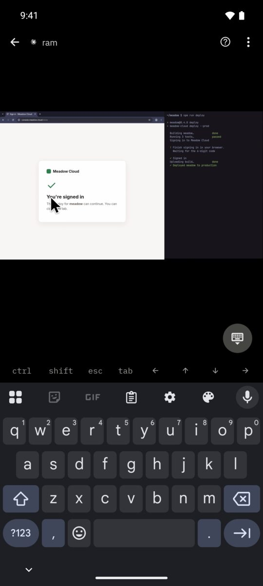</picture>
</p>

### Talk to the herd

Use native realtime speech-to-speech when typing is the slow part. Ask what changed, give a follow-up, and keep the same agent context.

[Voice setup →](docs/VOICE-SETUP.md)

<p align="center">
  <picture><source srcset="docs/assets/readme/voice.webp" type="image/webp">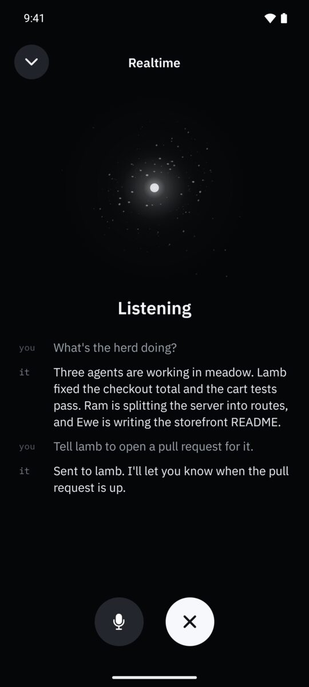</picture>
</p>

### Dictate the prompt

Tap the mic in the composer and speak. In the app, speech is transcribed on your phone as you talk, and the words land in the prompt for you to check before sending. Tap Stop to finish; during transcription, Cancel is on the opposite side so a second stop tap cannot discard your words. If you cancel, tap Undo within five seconds to restore them.

<p align="center">
  <picture><source srcset="docs/assets/readme/dictation.webp" type="image/webp">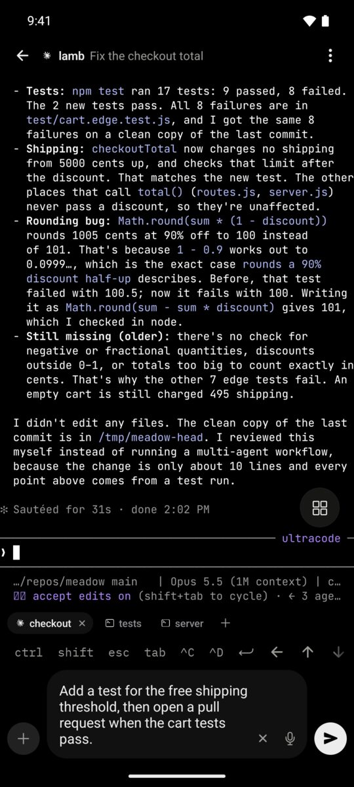</picture>
</p>

**Also on your phone:**

- **New agents and worktrees** — open the home composer to choose the machine, repository, worktree, and an installed agent. See [agent picker guidance](#use-the-agents-you-already-have). The resting dock hides Send until there's a draft or a submission in progress. On a short phone, scroll the open composer to reach its options and Start when the keyboard is visible. On a later launch, Home can show the last confirmed agents and spaces while reconnecting; they appear dimmed until the host responds, and closing a remembered space is unavailable.
- **Files, attachments, and changes** — inspect repository files, diffs, and agent outputs from your phone; download an agent's Shared Artifacts with progress and resume after a lost connection. On web, a download finished in the background offers **Save** when you return.
- **Settings** — under Appearance, choose a theme, terminal text size, and terminal colors; the browser terminal also offers System or IBM Plex Mono. Gestures lists terminal actions and the swipe and zoom choices. Under Notifications, choose alerts for agents needing you or finishing; enable browser notifications in the web app or manage permission and sound in your phone's system settings.
- **Desktop control** — see **Peek at your computer** above. Remote desktop works on Linux x64 hosts and macOS arm64; other Arm servers need the engine built from source. A Linux cloud server needs the virtual-display packages once. Android and web have desktop clients; on iPhone, open Computer in the web app (native iOS support is not yet available). [Remote desktop setup and limits](docs/SELF-HOSTING.md#remote-desktop-on-a-cloud-server) · [Host engine](https://github.com/umeranjum17/desklink/blob/main/packages/desktop-host/README.md)
- **[Extensions](https://trymuxr.com/docs/plugins)** — add phone-native controls and screens without forking the app.

Relay alerts on a sleeping native app show “Agent update”; the task title appears once the app runs. Browser alerts can show the task title before you open the app. If an alert belongs to another computer, tapping it opens Settings so you can select that computer.

If an accepted agent launch fails, its screen shows **Agent could not start**, a next step on the named computer, and **Back to Home**. When the terminal reports that the command was not found, the message asks you to install that agent CLI on the computer and try again; otherwise, it asks you to run the command there to see the error.

The [release history](https://github.com/umeranjum17/muxr/releases) is the real feature list.

## The whole party, in one place

Parallel agents work like a party: each has a job, a state, and moments when it needs you. muxr keeps the real terminals, diffs, inbox, and voice together without hiding what is happening.

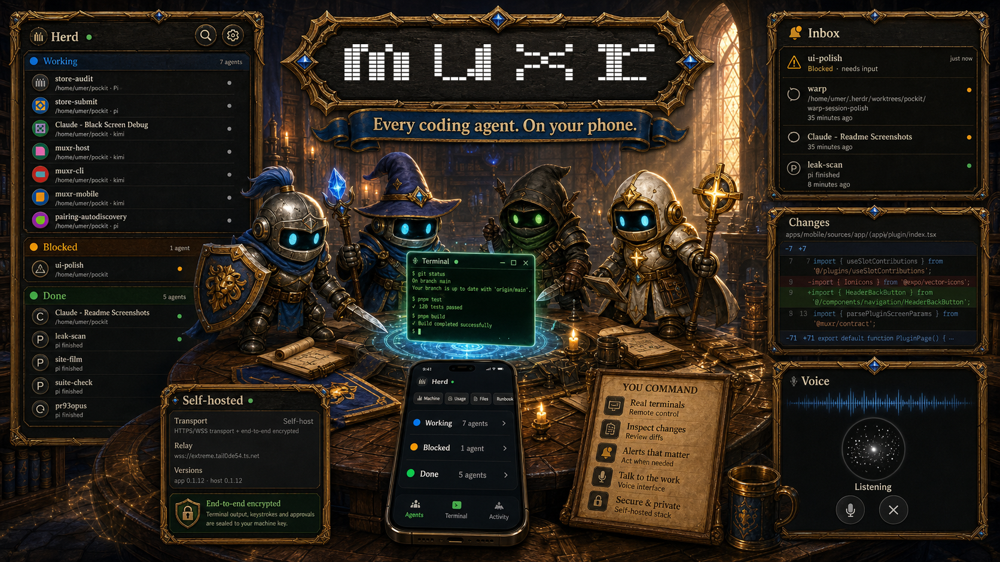

## Your machines, your relay

Your phone and computer stay connected over Wi-Fi, Tailscale, any mesh VPN, SSH alone, or a VPS you run. Pair once and every route carries your agents, terminals, and desktop. Older app builds and pairings from before the byokit cutover must update and re-pair once. Nobody else runs your agents.

Terminal text, prompts, responses, keystrokes, files, pairing secrets, and credentials remain end-to-end encrypted. Agents, repositories, model subscriptions, and encryption keys stay on your computer.

[Privacy and trust →](https://trymuxr.com/docs/privacy) · [Self-hosting →](docs/SELF-HOSTING.md)

## Install

You need [Node.js 22 or newer](https://nodejs.org/) on Linux, macOS, or WSL. muxr installs [Herdr](https://herdr.dev) during setup if it is missing.

```bash
npm install -g --ignore-scripts @trymuxr/cli@latest
muxr
```

In a terminal, `muxr` opens guided setup immediately when this computer has no saved setup. After setup, it opens the maintenance menu, where advanced options remain available. Without an interactive terminal, bare `muxr` prints command help; use explicit commands for automation.

Want the newest build? Install it with `npm install -g --ignore-scripts @trymuxr/cli@nightly` and take its APK from the [nightly channel](https://trymuxr.com/downloads/nightly). The **Android app** installs alongside a stable one rather than replacing it, so you can keep both on the phone. On your computer both channels are the same CLI, so switching npm tags replaces the host you already run rather than adding a second one. Beta and dev are retired: moving across is that one install, and an older binary will not upgrade itself to a `-nightly` version.

Then install the mobile companion:

- **Android (stable):** [download the stable APK](https://trymuxr.com/downloads/stable/android) · [stable checksum](https://trymuxr.com/downloads/stable/checksums)
- **Google Play testing:** [join the testing track](https://play.google.com/apps/testing/com.trymuxr.app) — availability depends on Google review and testing access
- **iOS TestFlight:** [open the public link](https://testflight.apple.com/join/aJSbs8pN) — build availability depends on Apple review and tester capacity. Store tracks review and roll out on their own schedule, so they do not move with the nightly APK
- **Web:** pair an eight-hour control or view-only browser during self-hosted setup. On compact screens, Home opens running agents and a control grant adds the bottom composer to start one, instead of bottom tabs. Search, Panes, and Settings live in the header; Usage opens from Home or Settings.
- **All builds:** [every download channel](https://trymuxr.com/downloads)

Save the channel's checksum next to the downloaded APK as `SHA256SUMS`, verify it with `sha256sum --ignore-missing -c SHA256SUMS`, then run `muxr`. Each channel publishes its own checksum, so verify against the channel you downloaded from. Choose a connection in the [guided route picker](docs/SELF-HOSTING.md#reaching-the-relay-from-your-phone), review the plan, and choose **Apply setup**; nothing changes before that confirmation. Scan the one-use QR from the phone when it is ready.

On the phone, tap **Scan the QR on your computer** to open the scanner directly (iOS asks for camera permission). The computer install command has **Copy** and **Share** actions. **Other ways to connect** stays visible: **Type the pairing code** opens an empty form for a `byokit-link:1:…` offer; **Connect over SSH** is also available on Android. Review the access to the named computer and tap **Pair** once. Matching words and progress appear inline: compare both words with the computer, then press `y` there to approve. Successful pairing opens Home automatically. An older QR asks you to update both devices and run `muxr pair` for a fresh link code.

The GitHub releases page ([latest stable release](https://github.com/umeranjum17/muxr/releases/latest), [all releases](https://github.com/umeranjum17/muxr/releases)) publishes the APK, AAB, and CLI assets behind the current stable build. Asset file names carry the version and build number, so download them from the release page rather than a bookmarked URL. At the time of writing that is muxr 0.2.0, shipping `muxr-0.2.0-377.apk` (171 MB), `muxr-0.2.0-377.aab` (133 MB), and `trymuxr-cli-0.2.0.tgz` (16 MB); `release-manifest.json` on the same page lists the sha256 of every asset.

[Read the step-by-step quickstart →](https://trymuxr.com/docs/quickstart)

## Use the agents you already have

muxr connects to sessions [Herdr](https://github.com/herdrdev/herdr) already runs. Your CLIs, subscriptions, configuration, skills, and MCP servers stay as they are. muxr never edits agent instruction files; load the compact `muxr --skill`, then request one focused topic with `muxr skill <topic>` only when needed.

Phone agent pickers show the agents installed on the connected computer, marked **Signed in**, **Needs sign-in**, or **Sign-in not checked**. Sign-in checks currently cover Claude Code and Codex; an unchecked sign-in is not confirmation that an agent is ready. Open **More agents** for install hints; uninstalled Pi has the hint **Installs on first start**. The home dock also offers **Shell (no agent)**.

The initial choice is your saved agent if it is installed and signed in, otherwise the first installed, signed-in agent. Pi is never the default. If none qualifies, the home dock selects Shell and the new-agent screen waits for you to pick. You can explicitly choose any installed agent, including one whose sign-in needs attention or has not been checked, and select up to four on the new-agent screen to start a squad.

After installing or signing in on your computer, tap **Check again**. Refresh keeps your current installed selections, including squads, and removes agents no longer installed; if no selection remains, it applies the default rule above. On Home, refresh or reconnection also replaces an automatic Shell fallback when an eligible agent becomes available, preserving an explicitly chosen Shell. This recovery remembers the earlier saved-agent preference while the dock stays open; reopening after an automatic Shell fallback can forget that preference.

A successful refresh on the new-agent screen clears open agent details; tap a card again to see its current guidance. A fresh new-agent screen starts in your last-used directory, or `~`; its **Start** button stays below the scrolling options.

<p align="center">
  
  
</p>

## Extensions

Add phone-native controls, screens, files, diffs, metrics, shortcuts, and realtime streams through the public extension API.

[Extension guide →](https://trymuxr.com/docs/plugins)

## Development

```bash
git clone https://github.com/umeranjum17/muxr
cd muxr
yarn install --frozen-lockfile
yarn typecheck
yarn run check
```

See [CONTRIBUTING.md](CONTRIBUTING.md) for development setup and pull requests.

## License

muxr is licensed under [Apache License 2.0](LICENSE). Third-party notices are recorded in [NOTICE](NOTICE) and the [license inventory](docs/license-inventory.md). The muxr name and marks are covered by [TRADEMARK.md](TRADEMARK.md).

## Development and nightly builds

Merging into `main` advances development, not production. Use the [release channel workflow](docs/RELEASING.md) for signed nightly APKs, verified npm artifacts and explicit stable promotion. Emulator acceptance stays local.
