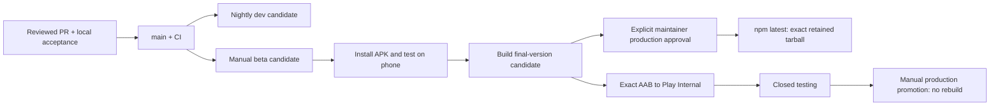

# Release channels

`main` is the development stream. Merging a PR does **not** publish production. Short feature branches merge through normal CI; a candidate freezes one green `main` commit while development continues.



## Build and try a candidate

Run **release candidate** on `main` after its CI succeeds. Choose `beta` for the current phone-testing cycle. Leave version empty for an automatically unique next-patch prerelease, or give an exact version such as `0.1.27-beta.1`. Nightly runs choose `dev` and skip a commit already built successfully. Final-version candidates require an explicit stable version such as `0.1.27`; they remain GitHub prereleases and are never automatically published to npm.

Every successful candidate attaches a signed ARM64 APK/AAB, npm tarball, compiled Android manifest, signer fingerprint and SHA256 release manifest to `v<VERSION>`. The source commit is shared by both products. GitHub Actions keeps the build artifacts for 90 days; the release assets remain available. Failed runs keep their logs and leave existing releases/channel pointers alone. GitHub runs builds and normal checks; emulator testing stays local.

- **Dev APK:** compiled `app.muxr.local.dev`, label `muxr Dev`, scheme `muxr-dev`, separate Android data. It cannot receive `muxr://` or production HTTPS pairing links. Default `dev.invalid` deliberately requires manual self-host pairing; no imaginary sandbox service is assumed. Build with `APP_ENV=development` and `-PmuxrDevelopmentApp=true`. This is a native Gradle configuration using the existing Release task, not an Expo-only identifier change.
- **Beta/final APK:** compiled `com.trymuxr.app`, updates the existing directly installed app and shares its data. It is not a second beta app. The production upload key signs these downloads. Store signing may differ: compare fingerprints before assuming a direct APK can update a Play install.
- **npm:** the verified publisher uses explicit `dev`, `beta`, or `latest` tags. Install with `npm install -g @trymuxr/cli@beta`; the exact attached tarball also works as a direct install. `muxr update` retains the installed channel. `muxr update --channel beta --yes` explicitly switches the current installation and managed services; it does not create an isolated second host. Registry downgrades require `--allow-downgrade`.

Build numbers are reserved through the `release-build-numbers` Git branch. Fast-forward-only updates serialize concurrent reservations; failed builds and retries consume numbers permanently. Never reset/delete this ledger or use git commit count as versionCode. The legacy manual Android builder accepts an explicit number for maintenance only: reserve through the same ledger first. The candidate workflow does that automatically.

## Public channel record

Every successful publication points one channel at the release that now holds it, and then proves that every public surface agrees. Versioned releases stay immutable: nothing is retagged, no artifact is copied, and no second GitHub Release is created to act as a pointer.

The pointer is one small catalog, `channels.json`, on the dedicated `release-channels` branch:

```
https://raw.githubusercontent.com/umeranjum17/muxr/release-channels/channels.json
```

```json
{ "schema": 1, "channels": { "beta": { "version": "0.1.27-beta.4.1", "appVersion": "0.1.27", "tag": "v0.1.27-beta.4.1",
  "releaseUrl": "…/releases/tag/v0.1.27-beta.4.1", "npmDistTag": "beta", "publishedAt": "…", "manifestUrl": "…/release-manifest.json",
  "android": { "url": "…/releases/download/v0.1.27-beta.4.1/muxr-0.1.27-360.apk", "sha256": "…", "bytes": 176639520, "versionCode": 360, "applicationId": "com.trymuxr.app" } } } }
```

Every field is derived from that release's own combined `release-manifest.json` — the npm-only candidate manifest carries no Android identity and is never used for this. Artifact URLs are always canonical `github.com/umeranjum17/muxr/releases/download/<tag>/<name>` with the manifest's exact digests. `npmDistTag` is `latest` for stable, `beta` and `dev` for the others. `manifestUrl` may be null only for the legacy stable `0.1.25` seed, which predates sealed manifests.

`publish npm` performs this automatically after a verified publication, in steps that can also be run by hand:

```
node scripts/release/presentation/promoteReleaseVisibility.mjs --tag v0.1.27   # stable only
node scripts/release/presentation/updateChannelCatalog.mjs --tag v0.1.27-beta.4.1
node scripts/release/presentation/verifyPublicRelease.mjs --tag v0.1.27-beta.4.1 --channel beta
```

The catalog update is idempotent and backfills any retained release without rebuilding. Before it writes anything it checks identity rather than names: the tag must point at the commit its manifest was sealed from, the APK asset GitHub serves must match the manifest's name, size and sha256 digest, the retained tarball must match its manifest digest and hash to the sha512 integrity npm published, and the npm dist-tag must already name that exact version. It then updates only its own channel, serializing concurrent writers through fast-forward-only ref updates — never a force push, never a backwards move, never the same version pointing at different bytes.

Verification is bound to the release being published, not to whatever a surface reports: the expected record is derived from the exact tag, and the check fails unless the catalog, `/api/releases/<channel>`, both redirects and the checksum line all carry that record, the npm dist-tag names that version, and GitHub's prerelease/Latest status is right for the channel.

Splitting the commands lets an initial migration seed the catalog before the website routes exist; the normal release path always runs all of them, and there is no bypass flag in CI.

Publications serialize through the `npm-publication` concurrency group with `cancel-in-progress: false` and `queue: max`, so a release that arrives while another is publishing waits its turn instead of replacing an already waiting one. The catalog is safe independently of that: its writes serialize through fast-forward-only ref updates and refuse backwards moves.

Durable website paths, served from that catalog: `/downloads/<channel>` for the human page, `/downloads/<channel>/android` redirecting to the canonical APK, `/downloads/<channel>/release` for the release page and `/downloads/<channel>/checksums` for digests, with `/api/releases/<channel>` returning the entry itself. Verification tolerates their short cache by retrying, never by weakening the comparison: it fails unless the served version and APK digest match the catalog and the redirect target is exactly the canonical artifact URL.

Release titles are `muxr <version>`. PR and build provenance belongs in the notes, not the title. Every candidate is created with `--prerelease --latest=false`, so a preview never becomes GitHub's Latest. Stable promotion clears the prerelease flag on that same release and makes it Latest, after the explicit approval and the npm integrity checks — without creating a release or rebuilding a binary — so `releases/latest/download/<asset>` follows the accepted stable instead of going stale. Beta and dev stay prereleases permanently.

## Stable promotion — only after the user accepts the candidate

1. Select the accepted source. Build a **stable** candidate with its final version. A beta npm tarball cannot be renamed into a stable version: this is a new package, and its exact installed artifact must pass checks before promotion. Preserve the beta evidence and compare source/native bytes. Repeat local emulator/phone checks when relevant bytes change.
2. Run **publish npm** with that successful candidate run ID and `confirmation=promote-VERSION`. The protected `production` environment requires maintainer approval. It downloads and verifies the retained tarball; it does not rebuild. An already published version must have exactly the same registry integrity. Automatic completion of a stable candidate never enters this promotion path.
3. For Android, run **mobile Android internal** with `candidate_run_id`, the matching app version/build number, `submit_to_play=true`, and `confirmation=release-VERSION-BUILD`. It verifies and uploads the candidate's AAB unchanged. Keep the resulting Internal run ID.
4. Run **mobile closed testing**, then **mobile Android production promotion**, with that Internal run ID, exact source commit, version and build number. Main may have advanced; the selected artifact's source and digest remain binding. Production remains protected and rollout is explicit. No Play upload/promotion is implied by a GitHub beta download.
5. Mark the GitHub candidate release stable only after the chosen platform promotions succeed. Record each platform separately. Keep previous releases and evidence; halt rollout/advance to a higher mobile build for regressions. Do not rebuild under an existing version/tag or overwrite release assets.

The `npm` environment is the npm OIDC identity. It allows the main workflow; the separate `production` environment gates stable publication. npm trusted publishing must name this repository, `publish.yml`, and environment `npm`. No npm token is stored in the repository. A trusted-publisher failure leaves the downloadable tarball/APK intact and does not claim registry success.

## Evidence before calling a feature stable

Link the exact local gate report and phone observations in the PR/release. A successful build is not proof of microphone audio, live browser paint or a historical crash fix. Record known limitations explicitly. Current terminal polish includes tested deliberate keyboard behavior and route continuity; transient blank frames around explicit IME resize remain a beta limitation.

Use a unique watched evidence directory for every local run. Keep failed runs alongside successful reruns. iOS delivery and OTA remain disabled pending their own native/signing/runtime validation. A separate iOS development app and fully isolated parallel CLI hosts are future work, not claims made by this first Android/npm channel rollout.
