# Release channels

```mermaid
flowchart LR
 PR[Reviewed PR + local acceptance] --> MAIN[main; no automatic Actions]
 MAIN --> TEST[Captain tests exact main commit]
 TEST --> CUT[Manual cut-release-branch dispatch]
 CUT --> BRANCH["release/<version>; fixes cherry-picked from main"]
 BRANCH --> CANDIDATE[Manual release-candidate dispatch from the branch]
 CANDIDATE --> PHONE[Install APK and test on phone]
 PHONE --> FINAL[Build final-version candidate]
 FINAL --> APPROVE[Explicit maintainer production approval]
 APPROVE --> NPM[npm latest: exact retained tarball]
 FINAL --> INTERNAL[Exact AAB to Play Internal]
 INTERNAL --> CLOSED[Closed testing]
 CLOSED --> PROD[Manual production promotion: no rebuild]
```

`main` is the development stream. Merging a PR or pushing to `main` does **not** start CI, build, or publication workflows. Captain-tested commits merge frequently; a release ships from its own `release/<version>` branch instead, cut from a tested `main` commit and carrying fixes cherry-picked from `main` — so the large feature branches under review can never ship an intermediate state. The branch name is the release version: every workflow below refuses to run anywhere but `release/<semver>`, and a requested version must match its branch. The repository workflows below are manual dispatches unless noted otherwise.



## Release notes

`apps/mobile/sources/changelog/changelog.json` is the only place release notes are written. Each marketing app version has exactly one entry — title, summary, `features`, `fixes`, `verification` (`passed|partial|failed|not-run`, with optional evidence path, digest, tested commit, environment and reviewer) and `knownLimits`. Older unversioned notes stay under `legacyEntries` and are still shown as earlier updates. Text is plain, never HTML.

Candidate preparation validates the entry right after the version is selected and before a build number is reserved: a missing entry, a duplicate version, malformed sections or no recorded changes fail the run, and no other version's entry is ever substituted. It then renders `what-changed.html` and `release-notes.md` into the candidate directory, so the existing seal and verification hash them like any other artifact. Publication attaches the retained `release-notes.md`; promotion consumes those retained bytes and never re-renders an older candidate from a newer checkout.

Evidence is a record of what was reviewed, not proof that a claim is true: statuses stay `partial` or `not-run` until a real run says otherwise, and emulator or phone acceptance is recorded separately from any build.

```
node scripts/release/presentation/changelog.mjs validate --version 0.1.27-nightly.1 --commit $(git rev-parse HEAD)
node scripts/release/presentation/changelog.mjs generate --version 0.1.27-nightly.1 --commit $(git rev-parse HEAD) --directory ./out
node scripts/release/presentation/changelog.mjs check    --version 0.1.27-nightly.1 --commit $(git rev-parse HEAD) --directory ./out
```

`check` fails on missing or stale output instead of rewriting it. Generated reports are release artifacts: never committed, never edited after preparation.

## Build and try a candidate

### Manual dispatch sequence

1. Test the desired `main` commit locally (`yarn run check`) and record `MAIN_SHA=$(git rev-parse HEAD)`.
2. Cut the release branch manually; fixes land on `main` first and are cherry-picked onto the branch afterwards:

   ```bash
   gh workflow run cut-release-branch.yml -f version="0.2.1" -f source_commit="$MAIN_SHA"
   ```

3. Test the branch head locally and dispatch the candidate from it, supplying that exact SHA and the version the branch names:

   ```bash
   gh workflow run release-candidate.yml --ref release/0.2.1 \
     -f source_commit="$BRANCH_SHA" -f channel=nightly -f version=
   ```

4. After the candidate is accepted, copy its run ID and dispatch publication manually from the same branch. Use `publish-VERSION` for a nightly; use `promote-VERSION` for a stable, which still waits for the protected production approval:

   ```bash
   gh workflow run publish.yml --ref release/0.2.1 \
     -f run_id="$CANDIDATE_RUN_ID" -f confirmation="publish-$VERSION"
   ```

   For a stable candidate, replace the channel/version in step 3 and use `confirmation="promote-$VERSION"` in step 4. Do not dispatch publication before captain acceptance. `ci.yml` is likewise available only by manual dispatch; it is not a release prerequisite. After this merges, cherry-picking only the workflow commit(s) onto the existing `release/0.2.0` branch is authorized so it can run the new flow; the `v0.2.0` tag stays at `fa0b780c`.

An automatic nightly version takes its base from the release branch name (`release/0.2.1` builds `0.2.1-nightly.N.M`), and is still rejected unless it sorts above the published stable, so a nightly can never sort under a stable promoted meanwhile. An explicit nightly or stable version whose base does not match the branch name is rejected, and a candidate whose published-channel state cannot be read fails rather than guessing a version that might sort too low.

Every successful candidate attaches a signed ARM64 APK/AAB, npm tarball, compiled Android manifest, signer fingerprint and SHA256 release manifest to `v<VERSION>`. The source commit is shared by both products. GitHub Actions keeps the build artifacts for 90 days; the release assets remain available. Failed runs keep their logs and leave existing releases/channel pointers alone. GitHub runs builds and normal checks; emulator testing stays local.

- **Nightly APK:** compiled `app.muxr.local.dev`, labelled `muxr Nightly` on signed distributions and `muxr Dev` on a local debug build, scheme `muxr-dev`, separate Android data, so it installs beside a stable app instead of replacing it. It cannot receive `muxr://` or production HTTPS pairing links. Default `dev.invalid` deliberately requires manual self-host pairing; no imaginary sandbox service is assumed. Build with `APP_ENV=development` and `-PmuxrDevelopmentApp=true`. This is a native Gradle configuration using the existing Release task, not an Expo-only identifier change.
- **Stable APK:** compiled `com.trymuxr.app`, updates the existing directly installed app and shares its data. It is not a second app. The production upload key signs these downloads. Store signing may differ: compare fingerprints before assuming a direct APK can update a Play install.
- **npm:** the verified publisher uses explicit `nightly` or `latest` tags. Install with `npm install -g --ignore-scripts @trymuxr/cli@nightly`; the exact attached tarball also works as a direct install. `muxr update` retains the installed channel. Switching channels explicitly replaces the current installation and its managed services; it does not create an isolated second host. Registry downgrades require `--allow-downgrade`.

Beta and dev are retired. Their npm dist-tags are frozen at their last releases and no longer move, and their GitHub releases stay exactly as published. Moving an existing beta or dev installation over is a one-time `npm install -g --ignore-scripts @trymuxr/cli@nightly`: an older binary's updater may refuse a `-nightly` version, so it will not carry itself across.

Build numbers are reserved through the `release-build-numbers` Git branch. Fast-forward-only updates serialize concurrent reservations; failed builds and retries consume numbers permanently. Never reset/delete this ledger or use git commit count as versionCode. The legacy manual Android builder accepts an explicit number for maintenance only: reserve through the same ledger first. The candidate workflow does that automatically.

### Desktop engine packages come first

The CLI pins `@desklink/host` to the exact version in `apps/host/package.json`, and that package's optional platform package carries the prebuilt engine. Both are built and released from [umeranjum17/desklink](https://github.com/umeranjum17/desklink); no workflow here publishes them: follow [Building and packing a release](https://github.com/umeranjum17/desklink/blob/main/packages/desktop-host/README.md#building-and-packing-a-release) there to build, check and publish them by hand, platform package first. A candidate refuses to start, before it spends a build number, unless npm already serves the pinned host and every engine package it names (`node scripts/release/presentation/requireDesktopEngine.mjs`), and publication checks the same for the exact tarball it is about to publish. npm trusted publishing cannot make a package's first publication, so the first version of each goes out from a maintainer's login.

## Public channel record

Every successful publication points one channel at the release that now holds it, and then proves that every public surface agrees. Versioned releases stay immutable: nothing is retagged, no artifact is copied, and no second GitHub Release is created to act as a pointer.

The pointer is one small catalog, `channels.json`, on the dedicated `release-channels` branch:

```
https://raw.githubusercontent.com/umeranjum17/muxr/release-channels/channels.json
```

```json
{ "schema": 1, "channels": { "nightly": { "version": "0.1.28-nightly.5.1", "appVersion": "0.1.28", "tag": "v0.1.28-nightly.5.1",
  "releaseUrl": "…/releases/tag/v0.1.28-nightly.5.1", "npmDistTag": "nightly", "publishedAt": "…", "manifestUrl": "…/release-manifest.json",
  "android": { "url": "…/releases/download/v0.1.28-nightly.5.1/muxr-0.1.28-370.apk", "sha256": "…", "bytes": 175400000, "versionCode": 370, "applicationId": "app.muxr.local.dev" } } } }
```

Every field is derived from that release's own combined `release-manifest.json` — the npm-only candidate manifest carries no Android identity and is never used for this. Artifact URLs are always canonical `github.com/umeranjum17/muxr/releases/download/<tag>/<name>` with the manifest's exact digests. `npmDistTag` is `latest` for stable and `nightly` for nightly. The retired `beta` and `dev` records stay readable in the catalog so links already published keep resolving; nothing writes to them again. Until the first nightly is published the site serves those historical records; from then on `/downloads/beta`, `/downloads/dev` and `/api/releases/{beta,dev}` answer HTTP 302 to their nightly equivalents, so an old link lands on the channel that continues that work. `manifestUrl` may be null only for the legacy stable `0.1.25` seed, which predates sealed manifests.

**publish release** is manual-only: it consumes a successful candidate run ID and reports a success summary once every public surface agrees. The same steps can be run by hand:

```
node scripts/release/presentation/promoteReleaseVisibility.mjs --tag v0.1.27   # stable only
node scripts/release/presentation/updateChannelCatalog.mjs --tag v0.1.28-nightly.5.1
node scripts/release/presentation/verifyPublicRelease.mjs --tag v0.1.28-nightly.5.1 --channel nightly
```

The catalog update is idempotent and backfills any retained release without rebuilding. Before it writes anything it checks identity rather than names: the tag must point at the commit its manifest was sealed from, the APK asset GitHub serves must match the manifest's name, size and sha256 digest, the retained tarball must match its manifest digest and hash to the sha512 integrity npm published, and the npm dist-tag must already name that exact version. It then updates only its own channel, serializing concurrent writers through fast-forward-only ref updates — never a force push, never a backwards move, never the same version pointing at different bytes.

Public surfaces do not converge instantly: the raw catalog is served by a CDN that holds a branch file for minutes and ignores a cache-busting query, and the website adds its own short TTL. Verification therefore waits for convergence against **one shared deadline across every surface**, rather than giving each its own window and multiplying the worst case. The catalog write is confirmed through the branch API, which is authoritative and uncached, so that wait happens once per publication.

Verification is bound to the release being published, not to whatever a surface reports: the expected record is derived from the exact tag, and the check fails unless the catalog, `/api/releases/<channel>`, both redirects and the checksum line all carry that record, the npm dist-tag names that version, and GitHub's prerelease/Latest status is right for the channel.

Splitting the commands lets an initial migration seed the catalog before the website routes exist; the normal release path always runs all of them, and there is no bypass flag in CI.

Publication runs the tooling from the commit the workflow file itself is running from, while the release identity — source commit, manifest, tarball and registry checks — stays bound to the candidate being published, so an older retained candidate is promoted by the current pipeline without rebuilding it.

Publications serialize through the `npm-publication` concurrency group with `cancel-in-progress: false`, so a release that arrives while another is publishing waits instead of interrupting it. GitHub keeps only one pending run per group, so a third release displaces the one still waiting: re-run it after the queue drains. The catalog is safe independently of that: its writes serialize through fast-forward-only ref updates and refuse backwards moves.

Durable website paths, served from that catalog: `/downloads/<channel>` for the human page, `/downloads/<channel>/android` redirecting to the canonical APK, `/downloads/<channel>/release` for the release page and `/downloads/<channel>/checksums` for digests, with `/api/releases/<channel>` returning the entry itself. Verification tolerates their short cache by retrying, never by weakening the comparison: it fails unless the served version and APK digest match the catalog and the redirect target is exactly the canonical artifact URL.

Release titles are `muxr <version>`. PR and build provenance belongs in the notes, not the title. Every candidate is created with `--prerelease --latest=false`, so a preview never becomes GitHub's Latest. Stable promotion clears the prerelease flag on that same release and makes it Latest, after the explicit approval and the npm integrity checks — without creating a release or rebuilding a binary — so `releases/latest/download/<asset>` follows the accepted stable instead of going stale. Nightly stays a prerelease permanently.

## Stable promotion — only after the user accepts the candidate

1. Select the accepted source. Build a **stable** candidate with its final version. A nightly npm tarball cannot be renamed into a stable version: this is a new package, and its exact installed artifact must pass checks before promotion. Preserve the nightly evidence and compare source/native bytes. Repeat local emulator/phone checks when relevant bytes change.
2. Run **publish release** with that successful candidate run ID and `confirmation=promote-VERSION`. The protected `production` environment requires maintainer approval. It downloads and verifies the retained tarball; it does not rebuild. An already published version must have exactly the same registry integrity. Automatic completion of a stable candidate never enters this promotion path.
3. For Android, run **mobile Android internal** from the release branch with `candidate_run_id`, the matching app version/build number, `submit_to_play=true`, and `confirmation=release-VERSION-BUILD`. It verifies and uploads the candidate's AAB unchanged. Keep the resulting Internal run ID.
4. Run **mobile closed testing**, then **mobile Android production promotion**, from the release branch with that Internal run ID, exact source commit, version and build number. Main may have advanced; the selected artifact's source and digest remain binding. Production remains protected and rollout is explicit. No Play upload/promotion is implied by a GitHub nightly download.
5. Mark the GitHub candidate release stable only after the chosen platform promotions succeed. Record each platform separately. Keep previous releases and evidence; halt rollout/advance to a higher mobile build for regressions. Do not rebuild under an existing version/tag or overwrite release assets.

iOS App Store builds are produced on the captain's Mac from the release branch, with no paid cloud build; `mobile-ios-internal.yml` remains a disabled stub. The site lives in `muxr-cloud`; its content lock points at a pockit commit and should point at the release branch's commit for the release.

The `npm` environment is the npm OIDC identity. It allows the main workflow; the separate `production` environment gates stable publication. npm trusted publishing must name this repository, `publish.yml`, and environment `npm`. No npm token is stored in the repository. A trusted-publisher failure leaves the downloadable tarball/APK intact and does not claim registry success.

## Evidence before calling a feature stable

Link the exact local gate report and phone observations in the PR/release. A successful build is not proof of microphone audio, live browser paint or a historical crash fix. Record known limitations explicitly. Current terminal polish includes tested deliberate keyboard behavior and route continuity; transient blank frames around explicit IME resize remain a known limitation.

Use a unique watched evidence directory for every local run. Keep failed runs alongside successful reruns. The GitHub iOS delivery workflow and OTA remain disabled pending their own native/signing/runtime validation. A separate iOS development app and fully isolated parallel CLI hosts are future work, not claims made by this first Android/npm channel rollout.
