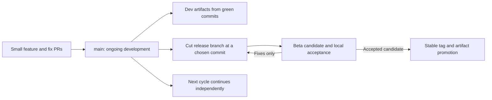
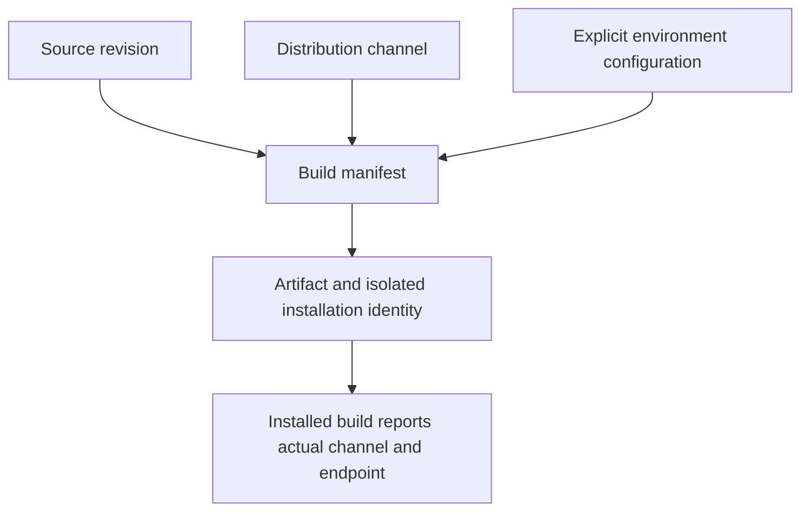
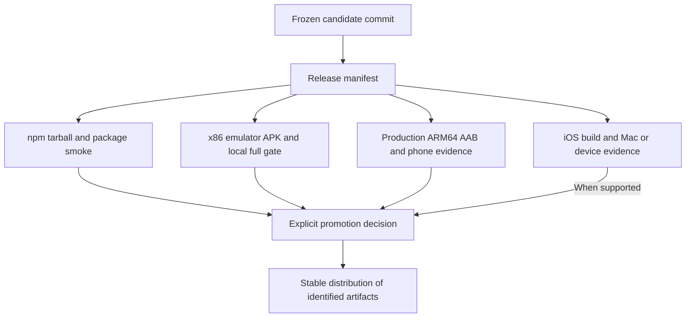
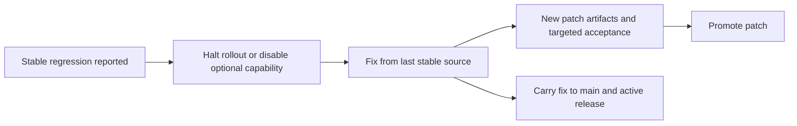

# muxr development, beta and stable release design

Status: approved and in progress. Prepared 2026-09-05 against `d40890f0`. This design is separate from completing PR #209; it does not change the source frozen for its current build.

## Recommendation

Use **one active development trunk (`main`), short feature branches, short-lived release branches, and three distribution channels: dev, beta, stable**. Production is an explicit promotion of a tested release, not a side effect of merging into main.

This lets us merge completed, reviewed increments while the previous release is being tested. A beta feature can remain disabled or confined to development installs without delaying unrelated stable fixes. There is still a minimum correctness bar: a known credential leak, destructive migration or shared-kernel crash cannot be waved through as “nightly.”

I recommend this for muxr rather than maintaining separate permanent `develop`, `staging` and `production` branches. Extra long-lived branches increase merge drift without providing the isolation that separate app IDs, host state and deployment credentials actually provide.

Comparable projects use this separation. Zed documents main-based nightly builds and a weekly preview branch that precedes stable; fixes can be cherry-picked during stabilization. VS Code Insiders provides daily builds alongside Stable. These are useful precedents, not proof that muxr should copy their exact cadence. [Zed release channels](https://zed.dev/faq), [VS Code Insiders](https://code.visualstudio.com/insiders/).

## Keep four concepts separate

| Concept | What it answers | muxr proposal |
| --- | --- | --- |
| Source branch | Where changes integrate | `main`, feature PRs, temporary `release/0.1.27` |
| Distribution channel | How much change a user opts into | `dev`, `beta`, `stable` |
| Deployment environment | Which servers, state and credentials a process uses | local, sandbox, production |
| Build identity | Which exact bytes were installed and tested | commit, version, platform, native digest, artifact SHA, signer |

A beta build is not inherently a sandbox build. Real-world testing may use a beta client against a production-compatible host, but that must be explicit. Stable users should remain on production defaults; development installs should default to isolated state and sandbox endpoints. A label alone must never select credentials or overwrite a production host.

## Branch and release lifecycle

1. **Feature PRs target main.** Require normal build/type checks, relevant existing flow tests, architecture checks and security scanning. Keep changes reviewable. Unfinished experiments either stay on their feature branch or ship behind a disabled capability flag if the shared path remains safe.
2. **Dev builds follow green main commits.** Publish at most one automatic nightly when source changed; allow an explicit on-demand build for a useful commit. A broken build leaves the last good dev pointer in place. Do not build a mobile binary for every documentation-only change.
3. **Cut a candidate branch.** For example, `release/0.1.27` starts at one selected green commit while main starts the next cycle. Candidate branches accept release fixes, not a stream of new features.
4. **Publish beta candidates.** Give every candidate a unique version/build number and immutable artifact manifest. Run the local emulator gate plus targeted phone/provider acceptance for changed behavior. Repeated candidate fixes do not stop main.
5. **Freeze a final candidate.** Build release-shaped packages and production-identity mobile binaries. Collect the exact build manifest, local acceptance report and CI result. Any source or artifact change creates a new candidate; preserve the failed one.
6. **Promote.** An authorized maintainer approves the recorded candidate. Publish its tested npm tarball, promote the already uploaded Android build, and select the tested iOS build when that path is validated. Attach artifacts and evidence to the stable release.
7. **Carry fixes forward.** Prefer fixes on main, then cherry-pick onto the release branch. Urgent release-first fixes must return to main through a small PR. Tag the released commit and retire the branch after the support window.

Start with a weekly beta opportunity and a stable release whenever a candidate is ready. The calendar should create a testing opportunity, not override failed evidence.

## npm: explicit tags, immutable versions

| Channel | Example version | User installation | Automatic behavior |
| --- | --- | --- | --- |
| Dev | `0.1.27-dev.20260905.17.gd40890f0` | `npm install -g @trymuxr/cli@dev` | Latest green development build advances `dev` |
| Beta | `0.1.27-beta.3` | `npm install -g @trymuxr/cli@beta` | Accepted candidate publication advances `beta` |
| Stable | `0.1.27` | `npm install -g @trymuxr/cli@latest` | Only explicit stable promotion advances `latest` |

Always pass the intended dist-tag when publishing. Bare `npm publish` assigns `latest`; it must not be the dev/beta path. Tags are movable labels, while a published name/version cannot be reused. [npm dist-tags](https://docs.npmjs.com/adding-dist-tags-to-packages/), [npm publish immutability](https://docs.npmjs.com/cli/commands/npm-publish/).

**Important promotion detail:** `0.1.27-beta.3` cannot be renamed into `0.1.27`, and changing package.json changes the tarball. After beta acceptance, prepare the final `0.1.27` tarball from the frozen release source, run installed-package smoke on that exact tarball, retain its SHA, and publish those bytes on approval. Do not pretend beta and final tarballs are identical. Keep the final-version candidate unpublished until promotion; prematurely publishing it under a non-latest tag can still expose it to explicit version/range consumers.

The pipeline should separate `build/package` from `publish`. Publishing consumes a specific successful build's tarball and verifies its digest and embedded release manifest. It must not rerun `yarn pack` after approval. Existing immutable versions are accepted only when registry integrity matches the intended artifact; “version exists” alone is insufficient.

Use the existing trusted-publishing/OIDC path with channel-specific environments. Treat npm metadata/tag promotion as an independent operation: a tarball already published successfully should not be rebuilt just because a later mobile submission fails.

### Parallel CLI installations

Installing different tags of the same global npm package does not give independent global binaries. The first iteration can support an explicit single-install channel switch with a restart and a visible channel/version report. The safer long-term design is a small launcher with separate immutable installations, such as `~/.local/share/muxr/channels/{stable,beta,dev}/<version>/`.

Host state also needs separation: independent MUXR_HOME, relay identity, service unit, socket/port and plugin registry context for a development host. Never relink the stable Herdr registry as an automatic side effect of trying `@dev`. If the installed Herdr cannot isolate registry ownership per context, fail the parallel-host setup and offer an explicit stop-and-switch workflow; do not claim side-by-side host isolation from package directories alone. Real auth HOME use must remain intentional, with no credential copying.

## Mobile: distinguish a development app from a store candidate

| Build | Identity | Distribution and purpose |
| --- | --- | --- |
| Development app | Separate Android application ID / iOS bundle ID, distinct icon, name and URI scheme | Install beside Stable; latest features; isolated state; sandbox default |
| Optional side-by-side beta app | Separate beta identity | Community experiments; useful convenience, but cannot become the stable store binary by relabeling |
| Release candidate | The permanent production identity | Android Internal/Closed track; iOS TestFlight once validated; same binary intended for stable promotion |
| Stable | Permanent production identity | Production store track and explicitly labeled direct-download artifacts |

Separate identifiers allow app variants to coexist. Because muxr checks in native Android/iOS projects, implement actual Android flavors and iOS schemes; changing `APP_ENV` in Expo config alone is insufficient. Do not regenerate the native directories with `prebuild --clean` without a deliberate native migration: muxr carries important native changes. [Expo app variants](https://docs.expo.dev/build-reference/variants/).

Use distinct deep-link schemes/associated-domain configuration, notification configuration, storage and display badges for development variants. A dev install must not steal stable pairing links. Capture the compiled manifest/bundle identifier in CI and the local gate rather than trusting an environment variable.

**Android:** keep the existing concept of promoting the tested Internal AAB/versionCode to Closed/Production without rebuilding. Reserve build numbers centrally per app identity so concurrent jobs and retries cannot reuse or go backwards. Do not use `git rev-list --count`: rebases, squash merges and parallel branches make it unsuitable as a durable store counter. Direct APK and Play App Signing certificates may differ; record their fingerprints and do not promise direct APK installs will upgrade a store install. [Play release tracks](https://support.google.com/googleplay/android-developer/answer/9859348?hl=en), [Expo version management](https://docs.expo.dev/build-reference/app-versions/).

**iOS:** retain the current disabled status until the local Mac path, signing, native voice, and TestFlight build are verified. Then use a distinct development scheme and promote the tested production-identity build through App Store Connect. Android success must not silently mark the iOS release ready.

**OTA:** keep OTA disabled or tightly restricted until runtime compatibility is established. Current `runtimeVersion: "2"` is not sufficient evidence that arbitrary future native changes are compatible. Derive and validate native runtime fingerprints, and scope update channels to app identity, environment and compatible runtime. A native voice/graphics change requires a new binary; do not deliver it as a JavaScript-only update. [Expo runtime compatibility](https://docs.expo.dev/eas-update/runtime-versions/).

## One release manifest binds the products together

Manifest fields: release ID, source commit/tree, channel, toolchain/dependency/native digests, artifact names and SHA256, package version, Android application ID/versionCode/signers, iOS bundle/build identity, runtime version, host protocol range, required capability IDs, CI run, local report digest, supported platforms and known limitations.

Support a deliberate host/mobile compatibility window, initially current and previous supported protocol generation where practical. Advertise capabilities and fail gracefully when a feature is unavailable. Deploy additive host support before clients that need it; keep destructive schema/protocol changes out until older clients are handled. Feature policy stays in the generic kernel/backend plugin contract, not duplicated per voice provider.

Releasing npm and mobile will not be atomically simultaneous: stores can delay approval. The release manifest must show per-platform state, and compatibility must make that delay tolerable. A backend patch need not wait for a mobile build when the mobile source and compatibility contract are unchanged and that fact is proved.

## Confidence without blocking all development

| Gate | Dev merge/build | Beta candidate | Stable promotion |
| --- | --- | --- | --- |
| Build, focused flow, architecture, secret/security checks | Required | Required | Required for exact candidate |
| Local emulator | Changed risky paths before calling them proven; no GitHub emulator workflow | Full gate for changed mobile/native candidate | Accept retained exact matching report; repeat only when relevant bytes changed |
| Physical phone/native voice or real browser | Label unverified experiments | Required for changed capabilities promised as release-ready | Evidence required, or feature excluded/disabled and limitation explicit |
| Package installation and host compatibility | Relevant flow | Packed artifact smoke | Exact final tarball and supported compatibility evidence |
| Known bugs | Public, channel-scoped, owned | Release blockers explicitly triaged | No accepted blocker hidden by a green aggregate |

Use a small issue vocabulary: `channel:dev/beta/stable`, `release-blocker`, `regression`, and an owner/target milestone. Bug reports should automatically include sanitized version/channel/commit, platform, protocol/runtime and artifact identity. A flaky fixture gets a real fix and retained failure; repeating until green is not a release process.

Flags should have an owner, default and removal milestone. Flags gate optional product capabilities; they are not permission/security boundaries. A feature that cannot be safely isolated stays outside the release. This is how ongoing work stops blocking unrelated shipping, while shipping still has a meaningful bar.

## Rollback and hotfix

For npm, stop advancing the channel and move its pointer back to a known good version for future installations if appropriate; already installed clients need an explicit supported downgrade/upgrade. Keep state migrations backward compatible or require backups. For mobile, halt rollout and issue a forward fix with a higher build number; a store rollout halt does not roll installed binaries back. Retain prior artifacts and reports rather than overwrite them.

## What to change in this repository

1. **Release metadata and publisher split:** one manifest generator, SemVer/channel validation, immutable artifact ingestion, explicit npm `dev`/`beta`/`latest`; skip irrelevant prerelease events before they start stable publishing. Current `publish.yml` only accepts stable `vX.Y.Z` and rebuilds while publishing.
2. **Native development variant:** real Gradle flavors/iOS schemes, unique IDs and links, isolated host/runtime state, channel in About/diagnostics. Current Expo config varies labels/IDs, but Android `applicationId` is fixed in build.gradle.
3. **Candidate workflows:** nightly only after green source and relevant changes; manual release-branch cut; candidate build; attach local gate evidence. Keep regular CI/build jobs in GitHub and emulator execution local.
4. **Promotion by immutable release ID:** existing Android production workflow already checks Internal artifact provenance and promotes without rebuilding. Replace its dependence on the current main SHA with verification against the chosen protected release commit/manifest so main can continue moving. Preserve digest, signer, version and eligibility checks.
5. **Controlled adoption:** trial the process on a development channel, then one beta cycle. Prove dev and stable installations coexist, channel selection cannot update the wrong installation, native incompatibility is rejected, and the promoted artifact is the tested one. Extend existing flow tests; do not add a dense test matrix.

The user approved implementation on 2026-09-05. Implementation is isolated in feat/release-channels after the PR #209 candidate. The existing stable product and credentials are not changed by drafting this spec. Publication and store promotion require their configured release gates.

## Implementation scope for the first rollout

The executable runbook is [RELEASING.md](../RELEASING.md). Main is the development stream; beta candidates freeze a green commit without requiring a permanent beta branch. Android uses a compiled Gradle development configuration while preserving existing Release task paths. An optional separate beta identity, parallel isolated host launcher and iOS variants remain future work; beta intentionally updates the current direct-install Android app. The nightly dev app uses manual self-host pairing rather than assuming a deployed sandbox. This trial promotes nothing to production.

## Implementation verification

- [ ] A complete dev-to-beta-to-final artifact flow proves channel/version rules, manifest digests, rejection of a changed artifact, and publication plan with no real registry/store mutation.
- [ ] Installed-package update flow retains the selected channel, rejects malformed registry responses and requires explicit channel switching.
- [ ] A compiled Android development identity can coexist with the production identity and cannot receive production pairing links.
- [ ] Production APK/AAB build and existing mobile policy checks remain valid.
- [ ] CI workflow checks prove that release selection is immutable, dev builds do not publish latest, and production promotion does not rebuild.
- [ ] Existing npm/package and relevant architecture flows pass; no new dense test suite.
- [ ] iOS remains explicitly unavailable until local Mac validation. No untested iOS delivery claim.
- [ ] External trusted-publisher/store/environment setup and any unexecuted publishing steps are recorded separately from local code validation.
